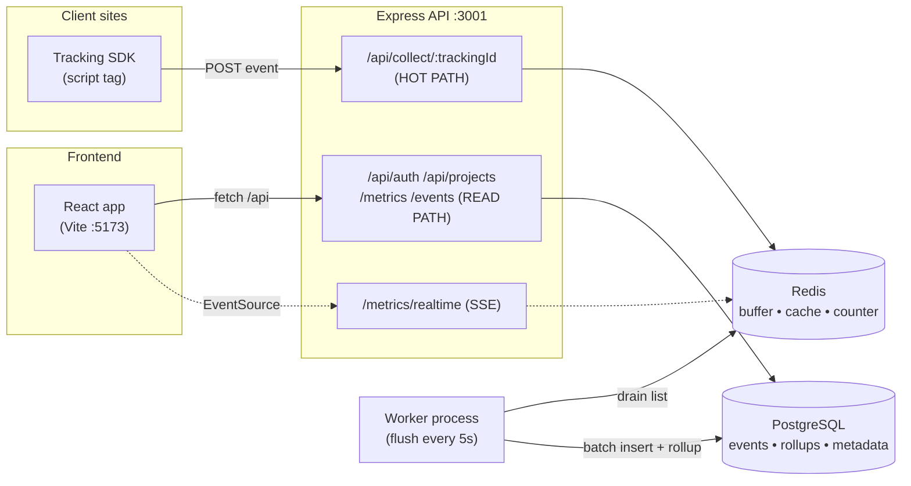
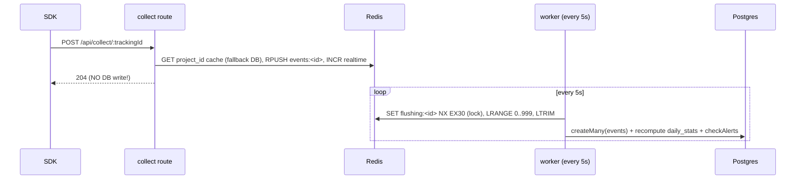
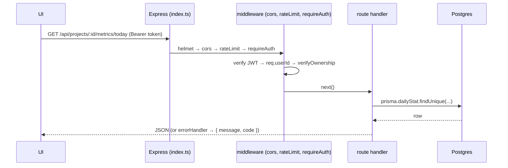
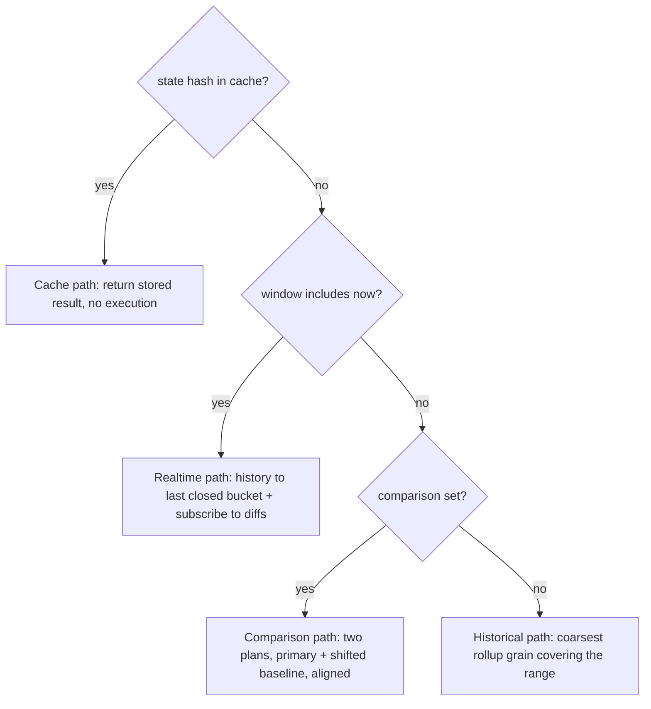
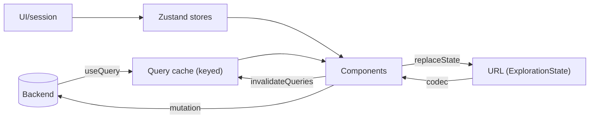
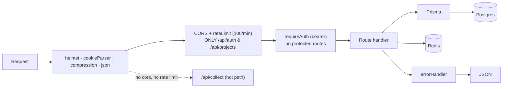

# The Logly Engineering Handbook

> **The single source of truth for everyone who builds Logly.**
> Read this first. If you read nothing else in the repo, read this.

This handbook teaches Logly end-to-end: *what* it is, *why* it exists, *how* every system works, *how*
the pieces connect, and *how you should think* while building it. It is written to be understood by a
fresher on day one and to still be useful to a Staff Engineer designing the next phase.

It documents **two things at once**, always clearly labelled:

- 🟢 **TODAY** — what is actually in this repository right now. This is what you will see when you open
  the code. Onboard from this.
- 🔭 **VISION** — where the design brief (`Logly product design brief/*.dc.html`) says the architecture
  is heading. This is the target the code is being grown toward.

When TODAY and VISION disagree (and they often do — the code is an honest MVP scaffold, the brief is the
full product), **the running code wins for "how it works today"** and the callout explains the seam that
lets us migrate from one to the other without a rewrite.

---

## How to read this handbook

Every chapter is layered. Read to your level; skim the rest.

| Layer | Icon | For | What it gives you |
|---|---|---|---|
| **Level 1** | 🟦 | Interns / freshers | Plain language, analogies, visuals. No assumptions. |
| **Level 2** | 🟨 | Junior → Mid engineers | How it's actually built: patterns, responsibilities, code paths. |
| **Level 3** | 🟥 | Senior → Staff / Architects | Trade-offs, scale, performance, evolution, the *why* behind decisions. |

Each major chapter also carries, where relevant: **Overview → Why it exists → Mental model → Diagram →
Responsibilities → Dependencies → Implementation (Today/Vision) → Common mistakes → Best practices →
Performance → Scaling → Debugging → Testing → Future evolution → Related chapters.** The classic study
aids from the original learning guide are preserved and extended: **Summary · Key takeaways · Interview
questions · Exercises · Further reading.**

**Companion docs (all in the repo):**
- `logly/GUIDE.md` — the senior-dev build spec (35-PR roadmap, load-bearing decisions). This handbook's
  §19 summarizes it.
- `logly/frontend/README.md` — the frontend quick reference (facts & commands).
- `Logly product design brief/*.dc.html` — the product spec / source of the VISION.
- `CLAUDE.md` — repo-wide instructions for tooling.

---

## Table of contents

**Part I — The Product**
1. [Executive Overview](#1-executive-overview)
2. [Project Status](#2-project-status)
3. [Complete Product Journey](#3-complete-product-journey)
4. [Product Overview](#4-product-overview)

**Part II — The Shape of the Code**
5. [Folder Structure](#5-folder-structure)
6. [Architecture Overview](#6-architecture-overview)
7. [User Flow](#7-user-flow)

**Part III — The Engines**
8. [Exploration Engine](#8-exploration-engine)
9. [Decision Engine](#9-decision-engine)
10. [State Management](#10-state-management)

**Part IV — The Systems**
11. [Frontend Architecture](#11-frontend-architecture)
12. [Backend Architecture](#12-backend-architecture)
13. [Database](#13-database)
14. [API](#14-api)
15. [Platform](#15-platform)
16. [Design System](#16-design-system)

**Part V — How We Work**
17. [Engineering Standards](#17-engineering-standards)
18. [Development Workflow](#18-development-workflow)
19. [Build Order](#19-build-order)
20. [Current Progress](#20-current-progress)

**Part VI — Growing as an Engineer Here**
21. [Learning Roadmap](#21-learning-roadmap)
22. [Common Mistakes](#22-common-mistakes)
23. [Debugging Guide](#23-debugging-guide)
24. [FAQs](#24-faqs)
25. [Glossary](#25-glossary)

---
---

# Part I — The Product

## 1. Executive Overview

### 🟦 Level 1 — What is Logly?

**Logly is a privacy-first, realtime website analytics product.** Think Google Analytics — but with no
cookies, no personal data, and answers that appear *instantly*. A customer adds one small `<script>` tag
to their website. Logly counts visits and shows charts, a live visitor count, and plain-language
insights about what changed and what to do about it.

```
        A customer's website                         Logly
   ┌──────────────────────────┐            ┌──────────────────────────┐
   │  <script src="logly"/>    │  event     │   counts, charts, live    │
   │  visitor clicks a page ───┼──────────► │   count, and "what to do" │
   └──────────────────────────┘            └──────────────────────────┘
              no cookies                          no personal data
```

- **The problem it solves.** Classic analytics is (a) a privacy & consent nightmare, and (b) slow and
  backward-looking — it tells you about *yesterday* and makes you dig for *why*.
- **Logly's answer.** *"Analytics tells you about yesterday. Logly tells you what to do right now."*

### 🟦 Who is it for?

| Audience | What they get |
|---|---|
| **Founders / operators** | A morning briefing: "here's the one thing that needs you today." |
| **Marketers** | Which campaigns, sources, and pages actually moved the needle. |
| **Product teams** | Realtime signal after a deploy: did the change help or hurt? |
| **Privacy-conscious teams** | GDPR/CCPA/PECR compliance *by construction* — no cookie banner needed. |

The demo persona throughout the brief is **Alex Santos**, founder-operator of `saralux.com` on the
**Pro** plan, mid product-launch.

### 🟨 Why does it exist? — the mission

Logly's guiding mission is **"Decision Velocity": shrink the gap between a question and a confident
decision.** Every architectural choice is judged against one question: *does this make the answer arrive
faster and more trustworthy?*

That mission is not a slogan; it is an engineering constraint. It is why:
- reads are precomputed (so dashboards feel instant),
- every view is a shareable URL (so a question is one paste away from a colleague),
- there is a **Decision Engine** that says *what to do*, not just *what happened*.

### 🟨 How is it different?

| | Classic analytics | **Logly** |
|---|---|---|
| Identity | Cookies + cross-site profiles | Daily-salted hash, unrelatable across days |
| Consent | Cookie banner required | None needed — nothing personal is stored |
| Speed | Query-on-read, slow | Precomputed rollups, "instant" reads |
| Output | Tables of what happened | Ranked, explained decisions ("what needs you") |
| Sharing | Screenshots | The URL *is* the saved view |

### 🟥 Level 3 — Mission, Vision, Principles

**Mission:** Decision Velocity — the shortest path from *question* to *confident decision*.

**Vision (from the System Architecture brief):** *"One system: events in, insights out, nothing personal
kept."* Logly ingests immutable events through one front door, processes them behind a queue, projects
them into precomputed reads, and pushes results live to isolated workspaces — deterministically,
recoverably, without ever storing who anyone is. The same architecture is meant to hold from one
workspace to global multi-region scale *without a redesign*.

**The six load-bearing principles** (these recur in every architecture doc — respect them or you will
fight the system):

```
1. Privacy is structural, not policy.
   No PII, no cookies. Identity = a daily-salted hash whose salt is
   held in memory, rotated every 24h, and destroyed. Two days of the
   same visitor are unrelatable BY DESIGN. Compliance follows for free.

2. Event-first & immutable.
   Events are an append-only log. Everything else (rollups, sessions,
   insights) is a *projection* you can rebuild. A correction is a new
   event, never an edit.

3. The write path and the read path are different problems.
   Ingestion optimizes for throughput and never dropping data.
   Reads optimize for correctness, low latency, and typed answers.
   They never block each other.

4. Speed is the product.
   Every interaction has a p95 latency budget. Answers must feel
   instant. The cheapest query is the one you precomputed.

5. One front door, shared contracts.
   Everything enters through the API layer against Zod schemas shared
   by client and server. Services own their data; they never reach into
   each other's stores.

6. Derive, never duplicate.
   One owner per fact; one source of truth; everything else derived and
   keyed back to the source. (Frontend mirror: server state lives in
   TanStack Query, never copied into a store.)
```

> **Summary.** Logly = private, realtime analytics whose product bet is *speed to decision* and whose
> engineering bet is *simple vendors, durable patterns, privacy as a shape*.

**Key takeaways:** privacy is a property of the data's *shape*, not a checkbox; "the write path and the
read path are different problems"; patterns outlive vendors.

**Interview questions:** *Why would an analytics product separate ingestion from querying? What does
"privacy by design" mean concretely here? Why is "the URL is the save button" a load-bearing idea?*

**Exercise:** Open `Logly product design brief/MVP Execution Blueprint.dc.html` and list what is in vs
out of the MVP. Cross-check against §20 of this handbook.

**Further reading:** Plausible/Fathom product pages (framing); "event sourcing" overview (Fowler).

**Related chapters:** [§6 Architecture](#6-architecture-overview) · [§8 Exploration Engine](#8-exploration-engine) ·
[§9 Decision Engine](#9-decision-engine) · [§13 Database](#13-database).

---

## 2. Project Status

### 🟦 Level 1 — Where the product is today

Logly is **partly built**. The *design* of the whole product is complete (the brief covers 21
documents). The *marketing/onboarding surfaces* exist as high-fidelity prototypes. The *working app* in
`logly/` is a real, coherent MVP scaffold — the backend ingestion architecture genuinely works — but
many feature screens are still placeholders, and there are no tests yet.

```
Overall build progress

Product design & spec   ████████████████████████████  100%   ✓ complete (brief, 21 docs)
Design system (code)    ████████████████████████████  100%   ✓ tokens + primitives shipped
Marketing website       ████████████████████████░░░░   85%   ✓ prototype (brief)
Auth & onboarding       ████████████████████░░░░░░░░   70%   ✓ flow built; email-verify stubbed
Installation flow        ████████████████████░░░░░░░░   70%   ✓ prototype (brief)
App shell (nav/⌘K)      ██████████████████████████░░   90%   ✓ sidebar, topbar, palette, toasts
Backend ingestion       ████████████████████████░░░░   85%   ✓ collector + worker + rollups work
Backend read API        ████████████████████░░░░░░░░   70%   🚧 works; some contracts mismatch FE
React dashboard         ██████████████░░░░░░░░░░░░░░░   50%   🚧 shell + widgets; data partly unwired
Exploration engine      ████░░░░░░░░░░░░░░░░░░░░░░░░░   15%   ⏳ URL-state planned, not built
Decision engine         ██░░░░░░░░░░░░░░░░░░░░░░░░░░░   10%   ⏳ specified; not implemented
Realtime (SSE)          ████████████░░░░░░░░░░░░░░░░░   45%   🚧 endpoint exists; auth mismatch (see §23)
Alerts delivery         ████████░░░░░░░░░░░░░░░░░░░░░   30%   🚧 queued but worker never started (§20)
SDK                     ████░░░░░░░░░░░░░░░░░░░░░░░░░   15%   ⏳ inline snippet only; no packaged SDK
Testing / lint / CI     ░░░░░░░░░░░░░░░░░░░░░░░░░░░░░    0%   ⏳ none yet — biggest quality gap
Production hardening     ██░░░░░░░░░░░░░░░░░░░░░░░░░░░   10%   ⏳ single process, no migrations committed

Legend:  ✓ done   🚧 in progress   ⏳ not started
```

### 🟨 Level 2 — Subsystem status, precisely

| Subsystem | Status | Notes (verified against the repo) |
|---|---|---|
| Design tokens | ✓ | `frontend/src/styles/tokens.css` + `tailwind.config.ts` — see [§16](#16-design-system) |
| UI primitives | ✓ | Button, Card, Input, Badge, Chip, Spinner, Toaster in `components/ui/` |
| Auth (register/login/me) | ✓ | `backend/src/routes/auth.ts`; JWT bearer + bcrypt cost 12 |
| Projects CRUD | ✓ | `routes/projects.ts`, scoped by `userId` |
| Collector hot path | ✓ | `routes/collect.ts` — Redis buffer, `204`, never hits Postgres inline |
| Flush worker + rollups | ✓ | `jobs/worker.ts` — drains Redis every 5s, upserts `daily_stats` |
| Visitor identity | ✓ | `lib/salt.ts` daily-salted hash; `Event.visitorId` column exists |
| Metrics/events read API | 🚧 | works, but several response shapes don't match what the FE reads (§23) |
| Realtime count (SSE) | 🚧 | `/metrics/realtime` exists but is auth-guarded while `EventSource` can't send the header (§23) |
| Alert evaluation | 🚧 | worker enqueues alerts; **the alert email worker is never started** (§20) |
| Dashboard widgets | 🚧 | `MetricCard`, `TrendChart`, `RealtimeCount` render; some bind to unimplemented fields |
| Feature pages | ⏳ | Goals, Alerts, Realtime, Pages, Sources, Locations, Devices, Setup → `SectionPlaceholder` |
| Tests / ESLint / CI | ⏳ | none; `npm run check` (tsc) + `build` are the only gates |

> **Summary.** The *architecture* is real and the *shell* is polished; the *feature depth* and the
> *quality harness* are the frontier. [§20](#20-current-progress) is the exhaustive implemented/pending/
> blocked/future breakdown.

**Related chapters:** [§20 Current Progress](#20-current-progress) · [§19 Build Order](#19-build-order) ·
[§23 Debugging Guide](#23-debugging-guide).

---

## 3. Complete Product Journey

### 🟦 Level 1 — From stranger to decision

This is the end-to-end path a customer travels. Each stage is a real surface in Logly (built or
specified). This is also the **Master Demo** spine: Website → Auth → Install → Dashboard.

```
   VISITOR                 (a stranger lands on logly.io)
      │  "what is this?"
      ▼
   WEBSITE                 marketing site — the pitch, the privacy story
      │  clicks "Sign up"
      ▼
   AUTHENTICATION          create account / sign in (email or GitHub/Google)
      │  verifies email
      ▼
   WORKSPACE CREATION      name workspace · pick region + timezone · invite team
      │  creates first project (site)
      ▼
   INSTALLATION            copy the one-line <script> snippet into the site
      │  framework auto-detected (Next / Vue / etc.)
      ▼
   VERIFICATION            Logly waits for the first live pixel → "we see you!"
      │  first events arrive
      ▼
   DASHBOARD               morning briefing · decision health · metrics · live count
      │  a question forms: "why did /pricing bounce spike?"
      ▼
   EXPLORATION             filter, group, compare — every view is a URL
      │  the shape of the answer emerges
      ▼
   INSIGHTS                "what needs you", ranked & explained (Decision Engine)
      │  the "so what" lands
      ▼
   DECISIONS               act — reversible, concrete: "segment /pricing by device"
```

### 🟨 Level 2 — What happens at each stage

| Stage | Surface (repo/brief) | What the engineer should know |
|---|---|---|
| **Website** | brief: *Logly Website* | Static marketing; the "Decision Velocity" positioning lives here. |
| **Authentication** | `pages/LoginPage`, `RegisterPage`; `routes/auth.ts` | JWT bearer + bcrypt; brief adds magic-link, OAuth, email verify (850ms simulated in prototype). |
| **Workspace creation** | brief: *Auth & Onboarding* (4-step wizard) | Workspace → invite → project → ready. **TODAY** the app has projects but no team/workspace layer. |
| **Installation** | brief: *Installation*; `SettingsPage` shows the snippet | Snippet: `<script defer data-site="…" src="https://cdn.logly.io/px.js">`. One script, ~1KB, no cookies. |
| **Verification** | brief: install doc live-verify | Backend already accepts events at `/api/collect/:trackingId`; verification = first event seen. |
| **Dashboard** | `pages/DashboardPage`; brief: *Dashboard V2* | Briefing + decision health + KPI cards + chart + breakdowns + right rail. |
| **Exploration** | brief: *Analytics Exploration*, *Exploration Engine* | The URL-encoded `ExplorationState` — [§8](#8-exploration-engine). |
| **Insights** | brief: *Dashboard V2* "what needs you" | Deterministic, ranked, explained — [§9](#9-decision-engine). |
| **Decisions** | across features (Goals, Alerts, filters) | Concrete + reversible actions; the mission realized. |

### 🟥 Level 3 — Why the journey is shaped this way

The journey is deliberately **front-loaded to first value**: the brief targets "about a minute" from
signup to a live workspace, and "one script tag away from your first decision." Every stage removes a
reason to churn — auto-detected framework snippets, skippable team invite, a live verification moment
that proves the product works *before* asking for trust. The final three stages
(Exploration → Insights → Decisions) are where Decision Velocity is won or lost: they compress the loop
from *"something changed"* to *"here's what to do."* The demo's finale line — **"Signal to decision in
two minutes"** — is the whole product in one sentence.

> **Summary.** Ten stages, one arc: stranger → live data → confident action, optimized so the first
> decision arrives in minutes.

**Interview questions:** *Where in this journey does Logly earn trust, and how? Which stage is the
riskiest for churn and why?*

**Exercise:** Walk the running app from `/login` to `/projects/:id` and mark which journey stages are
real vs placeholder today.

**Related chapters:** [§4 Product Overview](#4-product-overview) · [§7 User Flow](#7-user-flow) ·
[§8](#8-exploration-engine) · [§9](#9-decision-engine).

---

## 4. Product Overview

### 🟦 Level 1 — The features, in one line each

- **Dashboard** — the morning briefing + the numbers that matter.
- **Realtime** — who's on the site *right now*, updating live.
- **Analytics Exploration** — slice and dice: filter, group, compare.
- **Goals & Conversions** — did the thing you care about happen (signups, purchases)?
- **Alerts & Notifications** — tell me when something important changes.
- **Decision / Insight Engine** — not just numbers, but "what needs you," ranked.
- **Site Settings** — manage the site, team, keys, data.
- **Onboarding & Installation** — get set up and see your first data.

### 🟨 Level 2 — Every feature: why, who, dependencies, status

| Feature | Why it exists | Primary user | Depends on | Status (TODAY) |
|---|---|---|---|---|
| **Dashboard** | The default "how are we doing?" view | Everyone | rollups, metrics API | 🚧 shell + some widgets |
| **Realtime** | Instant feedback after a change/deploy | Operators | Redis counter, SSE | 🚧 endpoint + widget, auth gap |
| **Exploration** | Answer any question without SQL | Analysts, marketers | ExplorationState, rollups | ⏳ specified |
| **Goals & Conversions** | Measure outcomes, not just traffic | Marketers, PMs | events, `goals` table | ⏳ placeholder page |
| **Alerts & Notifications** | Don't stare at a dashboard | Operators | worker, `alerts` table, queue | 🚧 eval works; delivery off |
| **Decision/Insight Engine** | Turn data into action | Founders | rollups + baselines | ⏳ specified |
| **Site Settings** | Own your project & data | Owners/Admins | projects API | 🚧 details/snippet/delete |
| **Onboarding & Install** | Time-to-first-value | New users | auth, projects, SDK | 🚧 partial |
| **Team & RBAC** | Shared, safe access | Owners | teams tables, `can()` | ⏳ vision only |
| **Exports** | Take the data with you | Analysts | export jobs, S3 | ⏳ vision only |
| **Integrations** | Fit existing workflows | Ops | webhooks, importers | ⏳ vision only |
| **SDK** | Easy install everywhere | Developers | contracts | ⏳ inline snippet only |

### 🟨 Feature deep-cuts (from the brief, so you know the target shape)

**Goals & Conversions** — a **2-step drawer** (choose type → configure). Six goal types: page visit,
custom event, outbound link, file download, time on site, scroll depth. Statuses: Active / Paused /
Draft / Archived. Detail view shows conversion rate, live counter, trend with comparison, breakdowns,
and a **funnel** with per-step drop-off. Archiving keeps history but stops evaluation.

**Alerts & Notifications** — a **5-step wizard**: Metric → Condition → Threshold (+ sustained window
5m/15m/1h) → Channels → Review. Metrics include traffic spike/drop, conversion spike/drop, realtime,
404s/hour, JS-error events, no-traffic, new referrer/country. Conditions: `>`, `<`, `=`, `±%`,
above/below rolling average, vs previous day/week. Channels: Email + In-app (live), Slack/Discord/
Webhook (future). Statuses include a pulsing **Triggered**; mute = 24h suppression; pause = stop
evaluating.

**Analytics Exploration** — **4 lenses**: Realtime, Events, Sessions, Journey. Composable filter chips
(ANDed), saved views, and an export menu (CSV / PNG / PDF / copy-share-link / schedule) that always
respects the active filters — all mapping directly onto the [Exploration Engine](#8-exploration-engine).

### 🟥 Level 3 — How features relate (the dependency spine)

Features are not siblings; they stack. Everything downstream depends on ingestion and the
`ExplorationState` contract being right first — which is exactly why the build order (§19) blocks on
those two.

```
        Ingestion (events in)  ─────────────┐
                 │                            │  everything is a projection
                 ▼                            ▼   of the event log
        Rollups / read models ───► Exploration Engine (ExplorationState)
                 │                            │
                 ▼                            ▼
        Dashboard ── Realtime ── Goals ── Alerts ── Exploration lenses
                 │                            │
                 └──────────► Decision Engine ◄┘   (reads results + baselines,
                                    │               emits "what needs you")
                                    ▼
                               Decisions
```

> **Summary.** Eight core features, one spine: events → rollups → ExplorationState → every feature →
> Decision Engine. Depth is planned; the scaffold proves the spine.

**Interview questions:** *Which single contract, if wrong, breaks the most features? (ExplorationState.)
Why do Goals and Alerts both depend on the worker?*

**Exercise:** Pick one ⏳ feature and trace, using §13/§14, exactly which tables and endpoints it needs.

**Related chapters:** [§8](#8-exploration-engine) · [§9](#9-decision-engine) · [§13](#13-database) ·
[§14](#14-api) · [§19](#19-build-order).

---
---

# Part II — The Shape of the Code

## 5. Folder Structure

### 🟦 Level 1 — The repo has two apps and a spec

```
Logly/
├─ logly/                        ← THE ACTUAL APPLICATION (what you build in)
│  ├─ backend/                   ← Express API + background worker
│  ├─ frontend/                  ← React single-page app
│  ├─ GUIDE.md                   ← senior-dev build spec (35-PR roadmap)
│  └─ LEARNING_GUIDE.md          ← this handbook
├─ Logly product design brief/   ← THE PRODUCT SPEC (.dc.html design docs) — the VISION
│  ├─ *.dc.html                  ← 21 design-canvas documents
│  └─ screenshots/               ← 23 reference images
└─ CLAUDE.md                     ← repo-wide tooling instructions
```

> Rule of thumb: **`logly/` is reality. `Logly product design brief/` is the target.** This handbook
> keeps them clearly separated with 🟢 TODAY / 🔭 VISION callouts.

### 🟨 Level 2 — Backend tree (🟢 TODAY, verified)

```
logly/backend/
├─ prisma/
│  └─ schema.prisma              # the ONLY file here — no migrations/, no seed.ts yet
├─ src/
│  ├─ index.ts                   # Express bootstrap + the middleware seam
│  ├─ routes/
│  │  ├─ auth.ts                 # POST /register, /login ; GET /me   (no /logout — see §23)
│  │  ├─ projects.ts             # CRUD, all requireAuth, scoped by userId
│  │  ├─ metrics.ts              # today / trend / pages / events / realtime(SSE)
│  │  ├─ events.ts               # paginated raw event log
│  │  └─ collect.ts              # THE HOT PATH — ingestion beacon
│  ├─ jobs/
│  │  ├─ worker.ts               # flush worker (run separately: npm run worker)
│  │  └─ alertQueue.ts           # BullMQ queue + email worker (worker never started — §20)
│  ├─ lib/
│  │  ├─ prisma.ts               # singleton Prisma client
│  │  ├─ redis.ts                # two ioredis connections (redis + redisSub)
│  │  ├─ jwt.ts                  # sign/verify JWT
│  │  └─ salt.ts                 # daily-salted visitor hash
│  └─ middleware/
│     ├─ auth.ts                 # requireAuth (bearer) → req.userId
│     ├─ validate.ts             # Zod body validation
│     └─ errorHandler.ts         # throws → { message, code }
```

### 🟨 Frontend tree (🟢 TODAY, verified)

```
logly/frontend/src/
├─ main.tsx                      # bootstrap: providers, QueryClient, dev auto-login
├─ App.tsx                       # route table + ProtectedRoute/GuestRoute guards
├─ index.css                     # imports tokens.css
├─ pages/                        # route components (default export)
│  ├─ LoginPage  RegisterPage  ProjectsPage
│  ├─ DashboardPage  EventsPage  SettingsPage
│  └─ SectionPlaceholder         # the "coming soon" stand-in for unbuilt sections
├─ layouts/                      # persistent chrome
│  ├─ AppShell  Sidebar  TopBar  ProjectSwitcher
│  └─ nav.ts                     # single source of truth for nav items (implemented flags)
├─ components/
│  ├─ MetricCard  RealtimeCount  TrendChart  Wordmark
│  ├─ ui/                        # primitives: Button Card Input Badge Chip Spinner Toaster
│  └─ composite/                 # CommandPalette  EmptyState
├─ stores/                       # Zustand (client state only)
│  ├─ authStore  uiStore  toastStore
├─ lib/                          # framework-agnostic plumbing
│  ├─ api.ts                     # the ONLY fetch caller; attaches bearer; throws HttpError
│  ├─ queryKeys.ts               # query-key factories
│  ├─ devAuth.ts                 # dev-only auto-login
│  └─ cn.ts                      # className joiner
├─ hooks/  useToast.ts
├─ styles/ tokens.css            # design tokens (CSS vars)
└─ types/  index.ts              # shared domain + API types
```

### 🟨 What each folder is for (and what NOT to put there)

| Folder | Put here | Do **not** put here |
|---|---|---|
| `pages/` | route-level composition (fetch + arrange) | reusable widgets |
| `layouts/` | persistent chrome (sidebar, topbar) | one-off page UI |
| `components/ui/` | generic, prop-driven primitives | anything that fetches data or imports a store |
| `components/composite/` | reusable multi-part UI | feature-specific business logic |
| `stores/` | UI/session/client state | server data (that's TanStack Query's job) |
| `lib/` | the fetch client, key factories, helpers | React components |
| `styles/` | token values | component styles |
| `routes/` (backend) | HTTP handlers | heavy business logic (extract to services as it grows) |
| `jobs/` (backend) | long-running processes | request/response handlers |
| `lib/` (backend) | shared clients (prisma, redis, jwt, salt) | route logic |

### 🟥 Level 3 — The import direction is the real rule

The folder layout encodes a **one-way dependency gradient**:

```
   app  ──►  features  ──►  components  ──►  lib
   (never the other way; features never import features)
```

- `lib/` and `components/ui/` depend on almost nothing app-specific → they stay reusable.
- `lib/api.ts` may read `authStore` (to attach the token) — a deliberate *downward* dependency. The
  inverse (a store importing `api.ts`) would create a cycle and is forbidden.
- Remove `main.tsx` → nothing renders. Remove `lib/api.ts` → every data call breaks. Remove
  `jobs/worker.ts` → the API still runs but the dashboard never fills (events pile up in Redis).

🔭 **VISION — feature-first modules.** The brief's target frontend groups by *feature*, not file type:

```
src/
├─ app/          providers, router, entry
├─ features/     dashboard/ realtime/ analytics/ goals/ alerts/ projects/
│                settings/ billing/ team/ account/ onboarding/
│     └─ <feature>/  components/ hooks/ api/ types/ pages/ mock/   ← identical shape each
├─ components/   ui/ composite/ charts/   (3 tiers)
├─ layouts/  routes/  lib/  stores/  hooks/  providers/  styles/  config/
└─ types/  mocks/  assets/  test/
```

Each feature is **deletable in one move** and exposes only its `pages/` (to the router) plus a few
public hooks via a barrel `index.ts`. The `api/` folder is *the only place `fetch` is called* for that
feature. **Migration seam:** move each page into `features/<name>/` as it's reworked — the import
direction already points the right way, so this is incremental, not a rewrite.

🔭 **VISION — backend service layer.** The brief separates `controllers → services → repositories →
workers` with 11 bounded services (ingestion, aggregation, realtime, exports, alerts, …). **TODAY** the
code keeps business logic *in the route handlers* — pragmatic for an MVP. **Migration seam:** extract a
`services/` layer out of the handlers when a handler grows a second reason to change.

> **Summary.** Folders encode *responsibilities and dependencies*, not tidiness. TODAY: layered by kind
> with a one-way import rule. VISION: feature-first frontend + a service-layered backend — reachable
> incrementally because the import gradient already points downhill.

**Key takeaways:** "reusable" means "depends only downward"; the import direction is the single most
important rule to internalize.

**Interview questions:** *Why forbid feature→feature imports? Why can `api.ts` read a store but a store
must not import `api.ts`? What breaks if a `ui/` primitive imports the API client?*

**Exercise:** A new "Export CSV" button is used on 3 pages. Which folder does it belong in today, and
where would it live in the VISION structure? Justify both.

**Further reading:** "feature-sliced design"; "acyclic dependency principle"; `madge` (import-graph tool).

**Related chapters:** [§6 Architecture](#6-architecture-overview) · [§11 Frontend](#11-frontend-architecture) ·
[§12 Backend](#12-backend-architecture) · [§17 Standards](#17-engineering-standards).

## 6. Architecture Overview

### 🟦 Level 1 — Three programs and two stores

There are **two programs that talk over HTTP** plus a tiny third piece on customer sites:

- **Frontend** — the React app you see in the browser.
- **Backend** — the Express server that stores data and answers questions.
- **Tracking SDK** — the `<script>` on customer sites that *sends* events to the backend.

Behind the backend sit **two stores**: **Redis** (fast, temporary — a buffer and a cache) and
**PostgreSQL** (durable — the real data).

**The restaurant analogy.** Orders (events) arrive fast at the counter (the **collector**) and get
dropped on a ticket rail (**Redis**). The kitchen (**worker**) batches tickets and cooks them into
finished dishes (**rollups** in Postgres). The dining-room display (**dashboard**) shows what's ready.
The counter never makes you wait for the kitchen — that's the whole trick.

### 🟨 Level 2 — The system map (🟢 TODAY)



The same map as plain ASCII (for terminals):

```
  customer site        your browser
   ┌────────┐          ┌──────────┐
   │  SDK   │          │ React UI │
   └───┬────┘          └────┬─────┘
       │ POST event         │ fetch /api          EventSource (SSE)
       ▼                    ▼                          ┆
 ╔═══════════════════════════════════════════════╗    ┆
 ║             Express API  (:3001)               ║    ┆
 ║  /collect (hot)   /auth /projects /metrics ────╫────┘
 ╚═══════╤═══════════════════════╤════════════════╝
         │ RPUSH                 │ Prisma
         ▼                       ▼
   ┌──────────┐            ┌───────────┐
   │  Redis   │◄───drain───│  Worker   │──insert+rollup──►┌───────────┐
   │ buffer   │  every 5s  │ (separate │                  │ Postgres  │
   │ counter  │            │  process) │                  │ events    │
   └──────────┘            └───────────┘                  │ daily_stats│
                                                          │ metadata  │
                                                          └───────────┘
```

**Two seams that never block each other:**
- **Write seam:** `SDK → collect → Redis → worker → Postgres`
- **Read seam:** `UI → API → Postgres` (and `UI → SSE → Redis` for the live count)

### 🟨 Responsibilities & dependencies

| Component | Owns | Depends on | If it dies… |
|---|---|---|---|
| Collector (`routes/collect.ts`) | accepting events fast | Redis, tracking-id cache | events are refused; no data captured |
| Redis | buffer, cache, realtime counter, locks | — | ingestion + realtime break |
| Worker (`jobs/worker.ts`) | draining Redis → Postgres, rollups, alerts | Redis, Postgres | API runs but dashboards never fill |
| Read API (`routes/*`) | typed answers | Postgres, Redis (SSE) | dashboard can't load |
| Postgres | durable events + rollups + metadata | — | reads and durable writes fail |
| Frontend | the UI | the API | nothing to see |

### 🟥 Level 3 — Why this shape, and the two big bets

**Bet 1 — the hot/cold path split** is *the* architectural decision. The collector does the absolute
minimum (resolve id → validate → push to Redis → `204`) and **never writes to Postgres inline.** This
keeps ingestion latency tiny and decouples write spikes from database throughput. Redis is the shock
absorber.

**Bet 2 — precomputed read models (rollups).** Instead of scanning millions of raw events per dashboard
load, the worker maintains `daily_stats`. Reads become cheap lookups → "instant" UX. This is CQRS
(command/query responsibility segregation) and materialized views, applied pragmatically.

**Benefits:** resilience (a DB hiccup doesn't drop events — they wait in Redis), speed, clear ownership.
**Costs:** eventual consistency (a few seconds before events appear) and a second process (the worker)
you must run and monitor.

**Alternatives considered:**
- *Write straight to Postgres per event* — simplest, but couples ingestion to DB health and dies under
  load. Fine for a toy.
- *Kafka / Redis Streams + stream processors* — the web-scale answer; overkill for the MVP.
- *Serverless + warehouse* — cheap and spiky, worse for realtime.
The chosen middle path fits "one to three engineers, real but not web-scale traffic."

🔭 **VISION — the 8-layer platform.** The System Architecture brief describes one direction of flow with
a *boundary* and an *on-failure* behavior per layer:

```
Application → API → Services → Workers → Storage → Analytics → Realtime → Clients
     │         │        │         │         │          │          │         │
 cached      sheds   circuit-  DLQ +    cooler-    recompute   resume    retries
 last-good   load    breaks   idempotent tier      from log    cursor   w/ backoff
```

🔭 **VISION — two storage engines.** The brief splits storage by access pattern: an append-only
**columnar** store (ClickHouse) for events/sessions/aggregations, and a **relational** store
(PostgreSQL) for metadata (projects, goals, alerts, teams, keys, audit). 🟢 **TODAY** everything is in
Postgres. **Migration seam:** because reads go through rollups + a typed API, the event store can be
swapped Postgres→ClickHouse without rewriting the product. See [§13](#13-database).

> **Summary.** Two independent seams (write vs read), Redis as buffer/cache/counter, rollups for instant
> reads, a React shell over routed pages. TODAY it's one Postgres + a single worker; the VISION is an
> 8-layer platform with two storage engines — reachable through stable seams.

**Key takeaways:** decouple ingestion from querying; precompute what you read often; the seam is what
makes future engine swaps safe.

**Interview questions:** *What breaks if the worker stops? Why not write events directly to Postgres?
SSE vs WebSocket vs polling? What is the "seam" that makes a Postgres→ClickHouse migration safe?*

**Exercise:** Trace one event from `routes/collect.ts` to a row in `daily_stats` — name every hop and
every Redis key touched.

**Further reading:** "CQRS"; "materialized views"; MDN Server-Sent Events; Kleppmann, *Designing
Data-Intensive Applications*.

**Related chapters:** [§7 User Flow](#7-user-flow) · [§12 Backend](#12-backend-architecture) ·
[§13 Database](#13-database) · [§15 Platform](#15-platform).

---

## 7. User Flow

### 🟦 Level 1 — What happens when you click

Two very different journeys happen in Logly, and keeping them separate is the key to understanding the
whole system:

```
A) A VISITOR on a customer's site triggers a WRITE:
   click ──► SDK sends event ──► collector ──► Redis ──► (later) worker ──► Postgres

B) YOU in the dashboard trigger a READ:
   click ──► React ──► API ──► Postgres/Redis ──► typed JSON ──► screen updates
```

### 🟨 Level 2 — The write flow (deliberately cheap)



Step by step (🟢 TODAY, from `routes/collect.ts` + `jobs/worker.ts`):
1. Resolve `trackingId → projectId` via Redis `GET project_id:<trackingId>` (DB fallback, cached 5 min).
2. Zod-validate the body (`type`, `page`, `referrer?`, `eventName?`, `sessionId?`).
3. Enrich: derive `deviceType` (UA regex), `country` (`cf-ipcountry`/`x-country` header), and
   `visitorId` via `computeVisitorId(projectId, ip, ua)` (daily-salted hash).
4. `RPUSH events:<projectId>` → `SADD active_projects` → `INCR realtime:<projectId>` (+`EXPIRE 300`).
5. Return `204`. **No Postgres.** CORS is `*` (the SDK runs on third-party sites).
6. Every 5s the worker takes a `flushing:<id>` lock, drains up to 1000 events, `createMany`, then
   **recomputes** each affected day's `daily_stats` (`COUNT(*)`, `COUNT(DISTINCT visitor_id)`,
   `COUNT(DISTINCT session_id)`) via an idempotent `upsert`, then checks alerts.

### 🟨 The read flow (typed & guarded)



**Why two flows?** The write path optimizes for *throughput and never dropping data*; the read path
optimizes for *correctness and typed responses*. Mixing them (writing to Postgres in the collector)
would make ingestion as slow and fragile as your database.

### 🟥 Level 3 — The end-to-end latency story

🔭 **VISION — per-hop budgets** (Backend Architecture brief). The ingestion path targets **sub-10ms to
enqueue** before returning `202`; the *user's* path ends there. Processing (< 1s), aggregation (< 2s),
and realtime publish (< 2s) happen behind the queue, so a change shows up on the dashboard in **~2s**
end-to-end.

```
 beacon ~1ms → gateway+validate <2ms → normalize <3ms → enqueue <10ms  ┃ user path ends (202)
 ─────────────────────────────────────────────────────────────────────╂──────────────────────
 worker <1s → aggregate <2s → realtime publish <2s → dashboard ~2s     ┃ behind the queue
```

🟢 **TODAY** the seam is the same shape (collector returns `204` immediately; the worker does the heavy
lifting) but the cadence is a 5-second batch flush rather than a sub-second stream, and the collector
returns `204` (no body) rather than `202`. The *architecture* already matches the vision; only the
*latency constants* differ.

> **Summary.** Two flows with opposite priorities: writes are cheap and never blocking; reads are typed
> and guarded. The user's write path ends the instant the event is buffered.

**Key takeaways:** the collector deliberately does *not* touch Postgres; the worker owns everything
between Redis and the dashboard.

**Interview questions:** *Why is the collector's response `204`/`202` and not `200` with the stored row?
Where does eventual consistency come from and how long is the window?*

**Exercise:** Add a `console.log` at each hop of the write flow, fire one event, and record the order +
the ~5s delay before it lands in `daily_stats`.

**Related chapters:** [§6 Architecture](#6-architecture-overview) · [§12 Backend](#12-backend-architecture) ·
[§15 Platform](#15-platform) (budgets) · [§23 Debugging](#23-debugging-guide).

---

## 8. Exploration Engine

> This is the **heart of the product** and the contract every feature plugs into. 🟢 TODAY it is
> **specified but not yet implemented** in the app — but you must understand it, because the whole
> frontend is meant to be built around it, and the build order blocks on it.

### 🟦 Level 1 — "The URL is the save button"

Every question you ask Logly — a date range, a filter, a comparison, a chart type — is captured in **one
object called `ExplorationState`**, and that object lives **in the URL**. So:

- Change a filter → the URL changes.
- Copy the URL, paste it to a teammate → they see *exactly* your view.
- Press Back → you undo, because the previous URL is the previous state.

There is no hidden "current view" on the server. The state travels *with* the request. That's why the
backend can be stateless and any server can answer any question identically.

### 🟨 Level 2 — Why it exists

Analytics tools drown you in disconnected screens. Logly's bet: **one canonical state, many
projections.** You never "navigate to a different page" — you *mutate the state* and the same data
re-projects as a trend, a table, a funnel, a map. This is what makes exploration feel instant and
answers feel shareable. Guiding law: *"No view shall exist that cannot be represented by a serialized
ExplorationState."*

### 🟨 The contract (🔭 VISION — from the Exploration Engine brief)

`ExplorationState` fields. Scope tells you where each lives: **url** = shared in the URL, **derived** =
computed, **local** = device-only (never shared).

```
project      ProjectRef     url      root scope of every query
time         TimeRange      url      relative window as a TOKEN ("7d","mtd"), resolved at query time
metric       MetricRef      url      visitors, views, conversion rate, bounce…
filters      Filter[]       url      composable predicates, ANDed (path, referrer, device, country…)
segments     Segment[]      url      named reusable filter groups
grouping     Dimension[]    url      breakdown axis — page, source, country, browser…
sorting      SortSpec       url      column/series + direction
comparison   CompareSpec    url      previous period, prior year, rolling avg, custom
projection   ProjectionKind url      how to draw — trend, table, funnel, map, sankey…
realtime     RealtimeMode   url      off, or live-follow when the window includes now
selection    Selection      url      highlighted series/rows
focus        FocusRef       url      drilled-into node — page, funnel step, map region
pagination   PageSpec       url      cursor + page size
annotations  Annotation[]   derived  deploy markers, alert triggers on the timeline
savedView    SavedViewRef   url      identity if opened from a saved view
command      CommandState   local    ⌘K palette state (ephemeral)
ui           UiPrefs        local    density, theme, expanded panels
version      SchemaVersion  url      state-schema version for forward migration
extensions   Extension{}    url      reserved namespace (AI, experiments) — no migration
```

Every field has a sensible default, so **any partial state is valid and renderable**. Example URL:

```
?t=7d&m=conversions&f=device:mobile&g=path&c=prev&p=trend
```

**Hydration pipeline:** `parse → migrate → validate → default → complete live state`. Unknown/malformed
keys are dropped, never fatal. Large states are stored server-side and the URL carries a short **state
hash** instead.

### 🟨 Mutations, projections, planner

**Mutations** (each yields a *new immutable state*): `replace(field,val)`, `merge({patch})`,
`append(list,item)`, `remove(list,key)`, `toggle(field)`, `reset(field|all)`, `undo()`/`redo()`,
`goTo(snapshot)`.

**Projections (12) — "shape never changes meaning":** cards, trend, breakdown, feed, table, journey,
timeline, heatmap, sankey, funnel, map, compare. The same resolved result draws as any of these.

**Query planner — first match wins:**



### 🟥 Level 3 — The five caches (keyed off the state hash)

The state hash is the cache key for the entire read side. Same question → same hash → zero-query answer.

```
Projection cache   key=stateHash    ttl=session    client-side; back/forward is instant
Query cache        key=planHash     ttl=1–60 min   shared across users
Realtime cache     key=project+slice ttl=~2s        hot Redis counters, diff-refreshed
Sub-result cache   key=fragmentHash ttl=1–60 min   shared totals/breakdowns reused across views
Shared-link cache  key=stateHash    ttl=until stale first open warms it for the whole team
```

**Performance budgets (p95):** state mutation < 1ms · cache lookup < 10ms · URL update < 5ms · **filter
feedback < 50ms** · projection render < 16ms · fresh query < 400ms · comparison < 500ms · realtime ~2s.

**The state machine (10 states):** `idle → asked → resolving → cached / streaming / compared / shared /
saved / recovered / invalid`. Invalid degrades to the nearest valid state with a non-blocking notice —
*"every state is a valid state."*

🟢 **TODAY vs 🔭 VISION.** The current app stores the dashboard date-range in local `useState` and does
not serialize exploration into the URL. **This is the single highest-leverage thing to build next**
(GUIDE PR 3 + PR 15): introduce the `ExplorationState` type + a URL codec, then rebuild the dashboard's
filters/range/compare on top of it. Do this early — retrofitting URL-state after features exist is
painful, which is exactly why the build order front-loads it.

**Extensibility law:** *"New features extend the state; they never fork the engine."* A new feature is a
new field, a new projection, a new plan path, or a new context rule — not a parallel state container.

> **Summary.** One serialized, versioned, URL-borne state; 12 projections that never change meaning; a
> planner that prefers cache→realtime→comparison→historical; five caches keyed off the state hash.

**Key takeaways:** the URL *is* the state; the state hash *is* the cache key; the backend is stateless
because the state travels with the request.

**Interview questions:** *Why store time as a token ("7d") instead of resolved dates? How does
URL-as-state give you undo/redo and sharing for free? Why is a stateless backend easier to scale?*

**Exercise:** Design the compact query-string codec for `{time:"30d", filters:[device=mobile],
group:"path", compare:"prev"}`. Then define the `stateHash` inputs.

**Further reading:** the brief's *Exploration Engine* + *Analytics Exploration* docs; "URL as state";
"content-addressed caching".

**Related chapters:** [§10 State Management](#10-state-management) · [§9 Decision Engine](#9-decision-engine) ·
[§11 Frontend](#11-frontend-architecture) · [§14 API](#14-api).

---

## 9. Decision Engine

> Logly's differentiator: it doesn't just show numbers, it tells you **what needs you**, ranked and
> explained — **deterministically, with no AI.** 🟢 TODAY: specified, not implemented. 🔭 VISION below.

### 🟦 Level 1 — From "what happened" to "what to do"

A normal dashboard says: *"bounce rate: 58%."* Logly's Decision Engine says: *"Mobile bounce on
/pricing climbed to 58% — likely since the 11:40 deploy. **Segment /pricing by device.**"* It turns a
number into a **ranked, explained, actionable card**.

Crucially, it is **deterministic**: the same data always produces the same insight. No model, no
randomness, no hallucination — every recommendation can be traced back to the exact aggregates that
justify it.

### 🟨 Level 2 — How it works

The Decision Engine runs *after* a query resolves (budget < 5ms): it compares the result against a
baseline and emits the "so what" next to the numbers. The rule pattern is:

```
   metric-vs-baseline delta
 + dimensional concentration   (is the change isolated to one page/device/country?)
 + temporal correlation        (did it start at a deploy marker?)
 ─────────────────────────────
 → a templated headline + explanation + ONE concrete, reversible action
```

**Insight card anatomy:** category tag · priority pill · confidence (from evidence strength) · title
(*what*) · "Why" body (*the evidence*) · one CTA (*the action*). Cards are **ranked by priority**
(critical < high < medium < low) and the top 6 are shown.

**Example insight cards** (from Dashboard V2):

| Priority | What | Action |
|---|---|---|
| 🔴 critical | Mobile bounce on /pricing climbed to 58% | Segment /pricing by device |
| 🟠 high | Signups rose 6.7% right after the 11:40 deploy | Open the signup goal |
| 🟠 high | Hacker News drove +180% more referrals | View the source report |
| 🔵 medium | Unique visitors up 12.4% vs last period | Open /pricing traffic |
| ⚪ low | Page performance healthy (LCP 1.9s, CLS 0.02) | Review a sampled session |

Colors encode sentiment: green good, red bad, amber caution, blue neutral.

### 🟨 The Morning Briefing & Decision Health

Two dashboard surfaces are powered by the same deterministic reasoning:

- **Morning Briefing** ("since your last visit") — a one-paragraph narrative + signal chips
  (`Visitors +12.4%`, `HN referrals +180%`, `Mobile bounce 58%`) + CTAs. It answers *"what changed while
  I was gone, and what needs me?"*
- **Decision Health** — a single deterministic score (~86 "Healthy"). Bands: ≥80 Healthy (green), ≥60
  Needs attention (amber), else At risk (red). Rendered as a big number + progress bar.
- **"Today's story"** — a causal strip: *"11:40 deploy → visitors +12.4% → signups +6.7% →
  traffic-spike alert resolved → a healthy day."*

### 🟥 Level 3 — Why deterministic, and how it evolves

**Why no AI (yet)?** Trust and speed. A founder acting on an insight must be able to see *exactly* why —
"conversions fell 4pts on mobile only; desktop flat." Deterministic rules are explainable, testable,
reproducible, and fast (< 5ms), and they never invent a trend that isn't in the data. This is the
principle *"deterministic over clever."*

**How does AI fit later?** The brief is explicit: an AI copilot would be a **new mutation** (natural
language → an `ExplorationState` mutation), *not* a new engine. You'd type "why did signups drop?" and
the copilot would produce a filtered/compared state — which then flows through the same deterministic
resolution + insight rules. The engine's determinism is preserved; AI only helps you *ask*.

**Building it (the pragmatic path):** the rules need (a) a resolved result, (b) a baseline (comparison),
and (c) dimensional breakdowns + deploy markers. All three are outputs of the Exploration Engine — which
is why the Decision Engine is sequenced *after* it (GUIDE PR 16, after PR 15's ExplorationState).

> **Summary.** A deterministic layer that turns resolved results + baselines into ranked, explained,
> actionable cards; powers the Morning Briefing and Decision Health; extends via AI-as-a-mutation, never
> AI-as-the-engine.

**Key takeaways:** determinism buys trust, speed, and testability; every insight links to its evidence;
"deterministic over clever."

**Interview questions:** *Why would you choose rules over an ML model for a "what changed" feature? How
do you make an insight explainable and testable? Where would AI plug in without breaking determinism?*

**Exercise:** Write the rule (pseudocode) that produces the "Mobile bounce on /pricing climbed to 58%"
card: what deltas, what concentration check, what deploy correlation, what confidence?

**Further reading:** the brief's *Dashboard V2* insight engine section; "anomaly detection" (rules-based
vs statistical).

**Related chapters:** [§8 Exploration Engine](#8-exploration-engine) · [§4 Product Overview](#4-product-overview) ·
[§11 Frontend](#11-frontend-architecture).

## 10. State Management

### 🟦 Level 1 — Four kinds of state, three tools

**State** is data that changes over time and affects what you see. Mixing up the *kinds* is the #1
source of frontend bugs. Logly recognizes four kinds and uses a specific tool for each:

```
 LOCAL state       one component (a form input)          →  useState
 CLIENT/global     app-wide UI/session (sidebar? user?)  →  Zustand
 SERVER state      data the backend owns (metrics)       →  TanStack Query
 URL/exploration   the current question being asked      →  ExplorationState in the URL
 DERIVED state     computed from the above (a filtered list) → just compute it in render
```

### 🟨 Level 2 — The golden rule

> **If the server owns the truth, it lives in a `useQuery` — never copied into a store.**

| Kind | Lives in | 🟢 TODAY example | Tool |
|---|---|---|---|
| Local | `useState` | LoginPage email/password; dashboard date-range | React |
| Client/global | Zustand | `authStore` (token/user), `uiStore` (sidebar/⌘K), `toastStore` | Zustand |
| Server | TanStack Query | projects, `metrics/today`, events | TanStack Query |
| URL/exploration | the URL | 🔭 `ExplorationState` (planned) | codec + Router |
| Derived | render compute | `totalPages = ceil(total / PAGE_SIZE)` | — |

**Why the split?** Server state has hard problems — caching, deduping, staleness, refetching,
loading/error flags. TanStack Query solves all of them. Copy server data into Zustand and you re-inherit
those problems *and* risk it going stale.

### 🟨 The stores TODAY (`stores/`)

- **`authStore`** (persisted, `logly-auth`): `{ user, token, setAuth, logout }` in localStorage.
- **`uiStore`**: `useSidebarStore` (mode expanded/collapsed/mobile, persisted) + `useCommandStore` (⌘K).
- **`toastStore`**: the toast queue; rendered by `ui/Toaster`, produced via `hooks/useToast.ts`.

TanStack Query config (`main.tsx`): no refetch-on-focus, retry 1, `staleTime` 30s. Keys in
`lib/queryKeys.ts` (`projectKeys`, `metricsKeys`, `eventKeys`, `alertKeys`). `lib/api.ts` attaches the
bearer token and calls `logout()` on a 401. Server state is **never** mirrored into Zustand.



### 🟨 The four categories in the VISION

🔭 The brief specifies **11 Zustand stores** (client state only) plus URL-borne exploration:

```
authStore  projectStore  filterStore(→url)  themeStore  sidebarStore
notificationStore  drawerStore  dialogStore  onboardingStore
commandStore  settingsUiStore
```
Note `filterStore` persists to the **URL**, not localStorage — because filters *are* exploration state.
Overlays (drawer, dialog, command palette, toast) are each driven by a tiny store and mounted once at
the shell root.

### 🟥 Level 3 — Updates, re-renders, performance

- **Selectors prevent over-rendering.** `useAuthStore(s => s.user)` re-renders only when `user` changes.
  The beginner mistake `const store = useAuthStore()` subscribes to *everything*.
- **Query keys are cache primary keys.** `metricsKeys.trend(id, days)` uniquely identifies an entry;
  changing `days` fetches a new entry while the old stays cached. Mutations call
  `invalidateQueries({ queryKey })` to refetch precisely (hierarchical keys → targeted invalidation).
- **`staleTime` vs `refetchInterval`.** 🟢 TODAY the dashboard uses `refetchInterval: 30_000`.
  🔭 VISION is per-data-class caching: **realtime 0s · dashboard metrics 60s · lists 30s · settings 5m.**
- **`placeholderData: prev`** keeps the old page visible while the next loads — no flicker (EventsPage
  pagination).
- **Realtime without refetch:** the brief's `RealtimeProvider` pushes messages into the cache via
  `setQueryData` — a live update with zero extra fetches.

**The persistence decision tree** — *where should this piece of state live?*

```
Is it owned by the server?              ── yes ──► TanStack Query (useQuery)
        │ no
Is it "the question being asked"
(filters, range, compare, grouping)?    ── yes ──► the URL (ExplorationState)
        │ no
Is it app-wide UI/session
(theme, sidebar, auth, toasts)?         ── yes ──► Zustand (persist if it should survive reload)
        │ no
Does only one component care?           ── yes ──► useState
        │ no
Can it be computed from the above?      ── yes ──► derive it in render (don't store it)
```

> **Summary.** Four kinds of state, matched to four tools; never duplicate server state; subscribe with
> selectors; keys are the cache's primary keys; the *question* belongs in the URL.

**Key takeaways:** server-state libraries exist because server state is *hard*; the persistence decision
tree prevents 90% of state bugs.

**Interview questions:** *Why not put API data in Redux/Zustand? What's stale-while-revalidate? Why do
analytics filters belong in the URL rather than a store?*

**Exercise:** Make the dashboard date-range survive a reload and be shareable. Which tool? (Answer: the
URL — it's exploration state, per [§8](#8-exploration-engine).)

**Further reading:** TanStack Query "Important Defaults"; Zustand docs; Kent C. Dodds, "Application
State Management".

**Related chapters:** [§8 Exploration Engine](#8-exploration-engine) · [§11 Frontend](#11-frontend-architecture).

---

## 11. Frontend Architecture

### 🟦 Level 1 — A shell around routed pages

The frontend is a **single-page app**: one HTML file loads React, which swaps *pages* in and out as the
URL changes — no full reloads. A persistent **shell** (sidebar + top bar) stays put while the page area
(`<Outlet>`) changes. Guards decide whether you're allowed on a page before it renders.

```
main.tsx  (providers: QueryClient → Router → App)
   └─ App.tsx  (routes + guards)
        └─ AppShell  (sidebar · topbar · ⌘K · toasts)
             └─ <Outlet>  →  DashboardPage / EventsPage / SettingsPage / SectionPlaceholder
```

### 🟨 Level 2 — The three component tiers

| Tier | Location | Rule | Examples |
|---|---|---|---|
| **Primitives** | `components/ui/` | pure, prop-driven, token-styled, **no data fetching** | Button, Input, Card, Chip, Badge, Spinner, Toaster |
| **Composites** | `components/composite/` | primitives + interaction, still feature-agnostic | CommandPalette, EmptyState |
| **Feature/pages** | `pages/`, dashboard widgets | compose primitives *and* fetch data | DashboardPage (owns queries), MetricCard (renders given numbers) |

Patterns in use:
- **Container/Presentational** — pages fetch & arrange; primitives just render props.
- **`forwardRef`** on Button/Input so parents can focus/measure them (forms + a11y).
- **Guards** (`ProtectedRoute`/`GuestRoute` in `App.tsx`) centralize access rules so pages stay ignorant
  of auth.
- **Render-prop** via `NavLink`'s `{({isActive}) => …}` to style the active route.

**Boot sequence** (`main.tsx`): create `QueryClient` → `seedDevAuthIfEnabled()` (dev only) → render
`QueryClientProvider → BrowserRouter → App`. Provider order matters: Query is outside Router is outside
App, so every route can use both.

### 🟨 Routing & guards (🟢 TODAY, `App.tsx`)

```
/                         → redirect to /projects
/login  /register         GuestRoute (bounce to app if already signed in)
/projects                 ProtectedRoute (standalone list)
/projects/:id             ProtectedRoute → AppShell (Outlet):
   index                    DashboardPage        ✓
   events                   EventsPage           ✓
   settings                 SettingsPage         ✓
   realtime | goals | alerts | pages | sources
   locations | devices | setup   → SectionPlaceholder   ⏳
*                         inline 404
```

Data fetching is TanStack Query; the token rides on every request via `lib/api.ts`; `nav.ts` is the
single source of truth for sidebar items (each carries an `implemented` flag).

### 🟥 Level 3 — The VISION target & the gaps to close

🔭 The Frontend Architecture brief locks a richer stack and shape. Know it, because it's where the code
is heading:

- **Stack:** React **19** · TS 5 · Vite **6** · React Router **7** (lazy + loaders) · TanStack Query 5 ·
  Zustand 5 · Zod 3 · TanStack Table/Virtual · Recharts · Tailwind **4** (`@theme`) · **Radix** primitives ·
  Framer Motion · cmdk · Sonner · React Hook Form. 🟢 TODAY is React 18 · Vite · Tailwind v3 · Recharts ·
  lucide · a local `cn`, without Radix/RHF/Framer yet.
- **Feature-first modules** (see [§5](#5-folder-structure)) — each feature owns `components/hooks/api/
  types/pages/mock` and is the only place `fetch` happens for that feature.
- **Typed edges:** Zod validates every boundary (API responses, forms, URL params); types are *inferred*
  from schemas, never hand-written twice.
- **Accessible primitives:** interactive components wrap **Radix** (focus/keyboard/ARIA correct *before*
  styling). WCAG AA is a CI gate; `prefers-reduced-motion` gates every animation.
- **Lazy by default:** every route is a code-split chunk; data routes prefetch their first query on
  hover.
- **Error boundaries, nested:** root (full-page) → route (`errorElement`) → widget (a broken chart
  fails alone) → query (inline retry). 🟢 TODAY there are **no** error boundaries — a render error blanks
  the app. This is a high-value, low-risk gap to close.
- **Realtime:** one `RealtimeProvider` per tab, transport ladder **WebSocket → SSE → polling**,
  heartbeat 25s, reconnect backoff 1s→30s, feeds the Query cache via `setQueryData`.

**Performance budget (🔭):** initial JS **< 180KB** gzip (shell) · route chunk < 60KB · LCP < 1.8s ·
INP < 200ms; enforced by a CI bundle budget. 🟢 TODAY there's **no route code-splitting** (all pages in
one bundle) and **no list virtualization** (the events table renders every row) — the two biggest
frontend perf gaps as the app grows.

> **Summary.** TODAY: a clean shell + three-tier components + guards + TanStack Query/Zustand on React
> 18. VISION: feature-first modules on React 19, Radix-accessible, lazy, error-bounded, with a defended
> bundle budget. The gaps (code-splitting, error boundaries, virtualization, Radix) are low-risk wins.

**Key takeaways:** "props down, events up"; keep side effects out of primitives; the highest-ROI
frontend upgrades are error boundaries + code-splitting.

**Interview questions:** *Why keep data fetching out of `ui/`? Container vs presentational? What can a
React error boundary NOT catch (hint: async/event handlers)?*

**Exercise:** Convert one route to `React.lazy` + `Suspense` and measure the bundle change with
`vite build`.

**Further reading:** react.dev "Passing Props" & "Error Boundaries"; Radix UI docs; TanStack Query
"Important Defaults".

**Related chapters:** [§5 Folder Structure](#5-folder-structure) · [§10 State](#10-state-management) ·
[§16 Design System](#16-design-system) · [§8 Exploration Engine](#8-exploration-engine).

---

## 12. Backend Architecture

### 🟦 Level 1 — An Express server + a separate worker

The backend has **two runnable processes**:

1. **The API** (`npm run dev`) — an Express server that answers HTTP requests: log in, list projects,
   fetch metrics, and accept events.
2. **The worker** (`npm run worker`) — a separate long-running loop that moves buffered events from Redis
   into Postgres and builds rollups.

> ⚠️ **You must run both.** If the worker isn't running, events collect in Redis and never reach the
> database — the dashboard stays empty. This trips up everyone once.

### 🟨 Level 2 — The middleware seam (🟢 TODAY, `src/index.ts`)



- **Global:** `helmet`, `cookieParser`, `compression`, `express.json`.
- **Scoped to `/api/auth` + `/api/projects` only:** credentialed CORS (`CORS_ORIGIN`) + a 100-req/min
  rate limiter.
- **`/api/collect` is deliberately open:** no CORS restriction, no rate limit — it sets
  `Access-Control-Allow-Origin: *` itself and has its own `OPTIONS` handler, because the SDK embeds on
  third-party sites and must accept a firehose from any origin.

> 🚨 **Load-bearing:** never "helpfully" move auth or rate-limiting in front of the collector. Throttling
> the hot path throttles real analytics.

### 🟨 The pieces (🟢 TODAY)

| Piece | File | Role |
|---|---|---|
| Bootstrap | `src/index.ts` | middleware, mounts routers, `listen()` on **:3001** |
| Auth | `routes/auth.ts` | `POST /register` (bcrypt 12), `POST /login`, `GET /me`. **No `/logout`.** |
| Projects | `routes/projects.ts` | `router.use(requireAuth)`; CRUD scoped by `userId` |
| Metrics | `routes/metrics.ts` | `requireAuth` + `verifyOwnership`; today/trend/pages/events/**realtime(SSE)** |
| Events | `routes/events.ts` | paginated raw event log with type/date filters |
| Collector | `routes/collect.ts` | the hot path (see [§7](#7-user-flow)) |
| Worker | `jobs/worker.ts` | drains Redis → Postgres, rollups, `checkAlerts()` |
| Alert queue | `jobs/alertQueue.ts` | BullMQ producer + email worker |
| Shared | `lib/{prisma,redis,jwt,salt}.ts` | singletons + helpers |
| Middleware | `middleware/{auth,validate,errorHandler}.ts` | bearer verify, Zod, error shape |

**Redis is more than a buffer** (`lib/redis.ts`, two connections):

| Key/structure | Op | Purpose |
|---|---|---|
| `project_id:<trackingId>` | GET/SETEX 300 | trackingId → projectId cache |
| `events:<projectId>` (list) | RPUSH / LRANGE / LTRIM | the event buffer |
| `active_projects` (set) | SADD / SMEMBERS | which projects the worker should drain |
| `flushing:<projectId>` | SET NX EX30 / DEL | lock so two flushes don't double-drain |
| `realtime:<projectId>` | INCR / EXPIRE 300 / GET | the live counter |
| `redisSub` (2nd conn) | — | declared for pub/sub but **currently unused** (SSE polls instead) |

### 🟥 Level 3 — Decisions, gaps, and the VISION

**Idempotent rollups (a real lesson).** The worker **recomputes** each affected day's `daily_stats` with
`SET` (via `upsert`), not `increment`. Why: the flush can retry, and `increment` would double-count
across batches. *Aggregations must be idempotent when the producer can retry.*

**Authorization is coarse TODAY.** `requireAuth` + ownership via `userId`/`verifyOwnership` in queries.
Fine for MVP; a real product needs roles (Owner/Admin/Editor/Viewer) and per-resource checks.

**Known backend gaps (verified — see [§20](#20-current-progress)/[§23](#23-debugging-guide)):**
- The **alert email worker is never started** — `startAlertWorker()` is defined in `alertQueue.ts` but
  never called, so alerts enqueue and nothing sends them.
- **`POST /api/auth/logout` doesn't exist** — the frontend calls it; the 404 is silently swallowed.
- **SSE realtime is auth-guarded** but `EventSource` can't send an `Authorization` header → the realtime
  stream 401s. (Fix options in §23.)
- Several **metrics/events response shapes don't match** what the frontend reads (e.g. events returns
  `{events,...}` but the FE reads `data.data`) → some panels render empty. Reconciling these contracts is
  a top near-term task.
- **No committed migrations**, **no `prisma/seed.ts`** (despite the `db:seed` script).

🔭 **VISION — the production backend** (Backend Architecture brief). One tool per concern:

| Concern | 🔭 Vision | 🟢 Today |
|---|---|---|
| Framework | Fastify | Express 4 |
| Event store | ClickHouse (columnar) | Postgres (plain table) |
| Metadata | PostgreSQL | PostgreSQL ✓ |
| Queue | Redis **Streams** (consumer groups, DLQ) | Redis **list** (RPUSH/LRANGE) |
| Realtime | Redis pub/sub + SSE | SSE polling `realtime:<id>` |
| Versioning | `/api/v1` in the path | unversioned `/api/...` |
| Idempotency | `Idempotency-Key` header | event-id `skipDuplicates` |
| Services | 11 bounded services | logic in route handlers |
| Observability | OpenTelemetry → Prometheus/Grafana; Pino → Loki | `console.*` |

The brief specifies **11 services** (API, Auth, Ingestion, Aggregation, Realtime, Exports, Alerts,
Scheduler, Email, Webhooks, Jobs runner), each owning its data and talking via the queue or a typed API —
**never a shared-DB reach-in**. Latency budgets: ingest beacon **< 10ms** p99, dashboard API **< 150ms**
p95, realtime delivery **< 2s**, worker throughput **> 50k events/s per node**. SLOs: ingest availability
**99.99%**, dashboard uptime **99.9%**.

> **Summary.** TODAY: Express + a narrow middleware seam + Prisma + a single flush worker + Redis as
> buffer/cache/counter, with a few real gaps (alert delivery, logout, SSE auth, contract mismatches).
> VISION: a Fastify service mesh over ClickHouse + Redis Streams with per-hop budgets and full
> observability. The *shape* (hot/cold split, immutable events, rollups) is already right.

**Key takeaways:** middleware order and scope are design decisions; keep the hot path lean; make
retried operations idempotent; the collector is unguarded on purpose.

**Interview questions:** *Why not rate-limit `/api/collect`? Why recompute rollups instead of
incrementing? Where does authorization happen today and how would you harden it? Why does a columnar
store suit the event table?*

**Exercise:** Add the missing `POST /api/auth/logout` and wire `startAlertWorker()` into a process.
Which files, and which process should own the alert worker?

**Further reading:** Express "Using middleware"; Fastify docs; BullMQ docs; OWASP API Security Top 10.

**Related chapters:** [§6 Architecture](#6-architecture-overview) · [§7 User Flow](#7-user-flow) ·
[§13 Database](#13-database) · [§14 API](#14-api) · [§15 Platform](#15-platform).

## 13. Database

### 🟦 Level 1 — Where the data lives

Durable data lives in **PostgreSQL** (tables with rows and columns). **Prisma** lets TypeScript talk to
it with types instead of raw SQL. There are two *shapes* of data:

- **Events** — high volume, write-once (one row per pageview/custom event). Never edited.
- **Rollups** (`daily_stats`) — small, read-often summaries the worker keeps up to date.

Splitting them is why dashboards are fast: you read the tiny summary, not the millions of raw rows.

### 🟨 Level 2 — The schema TODAY (`prisma/schema.prisma`)

```mermaid
erDiagram
  User ||--o{ Project : owns
  Project ||--o{ Event : has
  Project ||--o{ DailyStat : "rolls up"
  Project ||--o{ Alert : has
  User { string id PK; string email UK; string passwordHash; string plan }
  Project { string id PK; string userId FK; string name; string domain; string trackingId UK }
  Event { string id PK; string projectId FK; string type; string page; string referrer; string country; string deviceType; string eventName; json eventProps; string visitorId; string sessionId; datetime createdAt }
  DailyStat { string projectId FK; date date; int views; int visitors; int sessions }
  Alert { string id PK; string projectId FK; string type; int thresholdPct; string_array emails; datetime lastTriggered }
```

Five models, verified:

| Model | Key fields | Notes |
|---|---|---|
| **User** | id(uuid), email(unique), passwordHash, plan="free", createdAt | the only entity tied to a real person |
| **Project** | id, userId, name, domain, **trackingId(unique)**, createdAt; `@@index([userId])` | trackingId is what the SDK sends |
| **Event** | type, page, referrer?, country?, deviceType?, eventName?, eventProps(Json?), **visitorId?**, sessionId?, createdAt; `@@index([projectId,createdAt])`, `[projectId,type]` | immutable, append-only; **plain table (not partitioned)** |
| **DailyStat** | `@@id([projectId,date])`, date, views, visitors, sessions | one row per project-day; `upsert`ed |
| **Alert** | type, thresholdPct, emails[], lastTriggered? | consumed by the worker's `checkAlerts()` |

> ✅ **Accuracy note:** `Event.visitorId` **exists** and the worker counts
> `COUNT(DISTINCT visitor_id)` separately from sessions — so *visitors ≠ sessions* is already real.
> (An earlier note in `CLAUDE.md` saying "no visitor_id, visitors==sessions" is **stale**.)

### 🟨 Data lifecycle & indexes

```
 event created (immutable)
      │  indexed by (projectId, createdAt) and (projectId, type)
      ▼
 buffered in Redis  ──► worker createMany(skipDuplicates)  ──► events table
      │
      ▼
 worker recomputes daily_stats for each affected UTC day
   views    = COUNT(*)
   visitors = COUNT(DISTINCT visitor_id)
   sessions = COUNT(DISTINCT session_id)
      │  idempotent upsert on (projectId, date)
      ▼
 dashboard reads daily_stats  (cheap lookup, never scans events)
```

Indexes match the query patterns: you filter/sort by `projectId + time` and `projectId + type`;
`trackingId` and `email` are unique for O(1) lookups. `DailyStat`'s composite PK `[projectId, date]` is
what makes the rollup an idempotent upsert.

### 🟥 Level 3 — Privacy, immutability, and the two-engine VISION

**Privacy encoded in the data** (`lib/salt.ts`). `visitorId` is a **daily-salted hash**:

```
 visitor_hash = SHA256( daily_salt + project_id + ip_address + user_agent )
                          │                          │
                     in memory only,           used to compute the hash,
                     rotated every 24h,        then DISCARDED (never stored)
                     destroyed at day end

 day N   → hash_A
 day N+1 → hash_B     (different salt → hash_A and hash_B cannot be linked, by anyone, ever)
```

So "visitors" is countable without ever storing a person. Cross-day identity is impossible *by design* →
GDPR/CCPA/PECR compliance follows automatically. **When specifying data, always distinguish:** *stored*
(path, referrer, country, device, daily hash) vs *hashed-then-discarded* (IP→country, IP+UA→hash) vs
*never stored* (names, emails, cookies, fingerprints, raw IP, precise location).

**Immutability.** Events are append-only; a correction is a *new* event. Rollups are projections you can
rebuild from the log. This is the event-sourcing mindset and it's what makes the store recoverable.

🔭 **VISION — two storage engines & 15 entities** (Database Schema + Data Architecture briefs):

- **Columnar (ClickHouse):** `events`, `sessions`, `aggregations` — immutable, `PARTITION BY (project_id,
  toDate(ts))`, `ORDER BY (project_id, ts)`, ~10–20× compression, TTL-based retention (drop whole
  partitions). `events.visitor_hash` is a `FixedString(32)` daily hash.
- **Relational (PostgreSQL):** `projects`, `domains`, `goals` (versioned), `alerts` (+ `alert_triggers`),
  team data, `api_keys` (hash-only, reveal-once), `audit_log` (append-only, monthly partitions),
  `export_jobs`, `notification_jobs`.
- **Ephemeral (Redis):** `realtime_presence` (~30-min TTL, never persisted).
- **Object storage (S3):** exports (signed, expiring URLs) + cold event archive.

**Aggregations** use ClickHouse's `AggregatingMergeTree` across grains **minute → hour → day → week →
month**; dashboards read the *coarsest grain that satisfies the range* (90d → daily; today → hourly +
realtime), and rollup writes bump a per-project version key that feeds cache keys.

**Retention (🔭):** events 30/90/365 days (per project) via partition drop; aggregations 13 months;
alert history 1 year; audit 1 year hot then cold; export files 24h; realtime presence ~30 min.

**The migration seam.** 🟢 TODAY's plain Postgres `events` table is the biggest scaling cliff (writes +
retention pruning get slow at volume). Because reads already go through `daily_stats` + a typed API, the
path is: **(1)** partition `events` by time (native Postgres), then **(2)** move hot analytics to
ClickHouse — without rewriting the product. *Don't pay for this before the traffic needs it.*

> **Summary.** TODAY: 5 Prisma models in Postgres — immutable events + small idempotent rollups + a
> daily-salted visitor hash. VISION: two engines (columnar events + relational metadata) with
> partitioning, multi-grain aggregations, and retention-by-partition-drop. Privacy is in the *shape*.

**Key takeaways:** model for your *read* patterns; immutable events + rebuildable projections; idempotent
aggregation; privacy is a property of the schema, not a policy doc.

**Interview questions:** *Why store rollups separately from events? What does a composite PK buy you?
How does a daily-salted hash give privacy AND still count unique visitors? Why does a columnar engine
suit events?*

**Exercise:** Write the Prisma query for "top 5 pages by views for project X in the last 7 days." Which
index does it use? Then sketch the ClickHouse equivalent reading a daily rollup.

**Further reading:** Prisma schema docs; Postgres "Partitioning"; ClickHouse `AggregatingMergeTree`;
Fowler, "Event Sourcing".

**Related chapters:** [§6 Architecture](#6-architecture-overview) · [§12 Backend](#12-backend-architecture) ·
[§14 API](#14-api) · [§15 Platform](#15-platform) (retention/tiers).

---

## 14. API

### 🟦 Level 1 — One front door

Everything the frontend needs comes through **one HTTP API**. You send a request (with your login
token), the server checks who you are and what you're allowed to do, runs the query, and returns JSON.
The tracking SDK uses a *separate, public* door (`/api/collect`) that needs no login.

### 🟨 Level 2 — The endpoints TODAY

```
PUBLIC (no auth):
  POST /api/collect/:trackingId     ingest an event → 204        (CORS *)
  OPTIONS /api/collect/:trackingId  preflight

AUTH:
  POST /api/auth/register           → { token, user }
  POST /api/auth/login              → { token, user }
  GET  /api/auth/me                 → user            (requireAuth)
  (POST /api/auth/logout            called by FE but NOT implemented — see §23)

PROJECTS (requireAuth, scoped by userId):
  GET/POST /api/projects            list / create
  GET/DELETE /api/projects/:id      read / delete

METRICS (requireAuth + verifyOwnership):
  GET /api/projects/:id/metrics/today     { today, yesterday, realtime, delta }
  GET /api/projects/:id/metrics/trend     { trend, days }
  GET /api/projects/:id/metrics/pages     { pages:[{page,views}] }
  GET /api/projects/:id/metrics/events    { events:[{eventName,count}] }
  GET /api/projects/:id/metrics/realtime  SSE stream (polls realtime:<id> every 5s)

EVENTS (requireAuth + verifyOwnership):
  GET /api/projects/:id/events      { events, total, page, totalPages }
```

Auth model TODAY: a **JWT bearer token** in the `Authorization` header, stored in `localStorage`
(`authStore`). `lib/api.ts` attaches it to every call and calls `logout()` on a 401.

> ⚠️ **Contract drift (see [§23](#23-debugging-guide)).** The frontend was written against an *idealized*
> response shape the backend doesn't return yet (e.g. FE reads `data.data` for events; expects flat
> `{views, viewsDelta, bounceRate}` for today). Reconciling these is a top near-term task. This is the
> practical cost of building FE and BE against slightly different mental models of the contract.

### 🟥 Level 3 — The VISION contract

🔭 The API & Integrations + Backend Architecture briefs define a **contract-first** surface:

- **Base + versioning:** `/api/v1` (version in the path); breaking changes bump the major; v1 supported
  ≥ 24 months; deprecations announced, dated, dual-run; a breaking change **fails validation in CI**.
- **Naming:** plural nouns, kebab-case, nested under `/projects/:id`.
- **Envelope:** `{ "data": {...}|[...], "meta": { "next_cursor": "…"|null, "total": 1240 } }`.
- **Errors:** `{ "error": { "code": "rate_limited", "message": "…", "retry_after": 38 } }`.
- **Pagination:** cursor-based (`?cursor=…&limit=…`) — O(page), not O(rows skipped).
- **Idempotency:** `Idempotency-Key` header on all POST/PUT.
- **Auth:** short-lived HttpOnly session for the app; scoped API keys `lgly_sk_…` (hash stored, secret
  shown **once**) for programmatic use.
- **Authorization:** `can(actor, action, resource)`, evaluated **per resource + action** (not per route),
  deny-by-default; roles **Owner > Admin > Analyst > Member > Viewer**; ownership checked before role;
  the workspace id is derived server-side from the session so **cross-tenant access is structurally
  impossible**.

**19 resource surfaces (🔭):** analytics, events, visitors, sessions, journeys, funnels, goals, alerts,
deployments, comments, saved, notifications, users, teams, projects, billing, audit, exports,
integrations.

**Realtime contract (🔭):** SSE single connection, scoped channel (project/object/metric), messages
carry the *change* (client patches in place), reconnect resumes from `Last-Event-ID`, heartbeat ping
every 25s, polling fallback every 10s. 🟢 TODAY realtime is an SSE endpoint that *polls* a Redis counter
every 5s (no pub/sub, no cursor).

**Integrations (🔭):** signed **webhooks** (at-least-once, ordered per subscription, exp-backoff retry →
dead-letter → replay); **importers** (CSV, GA4, Segment, Mixpanel, warehouse, historical backfill);
**exports** (CSV/JSON/scheduled/snapshots/warehouse); **SDKs** (Web/Node/React shipping; RN next; edge
planned).

**Auth flow (🔭):** Identity → Sessions (device- + single-workspace-bound, instant revoke) → Tokens
(scoped, rotate/revoke independently) → Workspace scope (server-derived) → Permissions (`can()` before
any read).

> **Summary.** TODAY: an unversioned bearer-token API with a handful of working endpoints (and some
> contract drift to fix). VISION: a versioned, contract-first, cursor-paginated, idempotent front door
> with 19 resources, `can()`-based authz, signed webhooks, importers, exports, and SDKs.

**Key takeaways:** one front door; the schema *is* the contract (shared Zod); derive workspace scope
server-side so tenants can't cross; version at the boundary and let callers opt in.

**Interview questions:** *Why cursor pagination over offset? What does an `Idempotency-Key` protect
against? Why derive the workspace id server-side instead of trusting the request? How do you deprecate an
API version without breaking callers?*

**Exercise:** Pick one drifted endpoint from §23 and write the reconciliation: change the backend to the
FE's expected shape *or* the FE to the backend's — and justify which, and how you'd version it.

**Further reading:** the brief's *API & Integrations* doc; "cursor pagination"; RFC 8725 (JWT best
practices); Stripe API design (envelopes/versioning as a reference).

**Related chapters:** [§12 Backend](#12-backend-architecture) · [§13 Database](#13-database) ·
[§8 Exploration Engine](#8-exploration-engine) · [§17 Standards](#17-engineering-standards).

---

## 15. Platform

> How Logly is deployed, observed, scaled, kept reliable, and secured. 🟢 TODAY this is minimal (two
> local processes + Docker Compose for Postgres/Redis). 🔭 VISION is a full operated platform. Both below.

### 🟦 Level 1 — Running Logly today

```
docker compose up -d     # start Postgres (:5432) + Redis (:6379)
npm run db:migrate       # apply the schema
npm run dev              # API on :3001
npm run worker           # the flush worker — SEPARATE process, run alongside dev
# frontend:
npm run dev              # Vite on :5173, proxies /api → :3001
```

That's the whole platform TODAY: two Node processes and two containers on one machine. No CI, no
monitoring, no autoscaling yet.

### 🟨 Level 2 — Deploy, monitor, scale, reliability, security (TODAY vs VISION)

| Concern | 🟢 Today | 🔭 Vision |
|---|---|---|
| **Environments** | local only | Local → Dev → Preview (per-PR) → Staging → Production |
| **Artifacts** | run from source | immutable containers, build once / promote unchanged |
| **Rollout** | manual restart | Blue/Green + Canary, health-gated, one-command rollback |
| **Migrations** | `prisma migrate dev` (none committed) | expand-contract, backward-compatible, run before rollout |
| **Monitoring** | `console.*` | OpenTelemetry (RED+USE) → Prometheus/Grafana; Pino → Loki; traces (Tempo) |
| **Health** | — | `/healthz` liveness + `/readyz` readiness; heartbeats; synthetic checks |
| **Scaling** | single worker, single API | stateless replicas + HPA on **CPU + queue depth**; read replicas; partition-by-project |
| **Reliability** | Redis buffer + idempotent rollups + flush lock | retries+jitter, circuit breakers, timeouts, fallbacks, queues, replay-from-log |
| **Security** | helmet, scoped CORS, bcrypt, Zod, bearer token | TLS 1.3 + AES-256 at rest, Argon2id, RBAC, secrets vault, token-bucket rate limit, immutable audit, CSP/HSTS |

### 🟥 Level 3 — Budgets, SLOs, failure modes, tiers

🔭 **Latency budgets** (Engineering Readiness — "speed is the feature"): 18 defended budgets, e.g.
app start **< 1.5s**, dashboard load **< 400ms**, **filter feedback < 50ms**, cached query < 10ms, fresh
query < 400ms, comparison < 500ms, command palette < 50ms, keyboard nav < 16ms (one frame), realtime
~2s. **Every budget is defended in CI** (a regression blocks the release).

🔭 **SLOs:** availability 99.9% monthly · filter feedback p95 < 50ms · fresh query p95 < 400ms · realtime
freshness < 3s · error rate < 0.1%. Ingest availability 99.99%, ingest p99 < 50ms.

🔭 **Scale targets (launch → target):** concurrent users 1K→1M+ · streams 5K→500K+ · projects 10K→10M+ ·
events/day 100M→100B+ · API 1K→1M+ rps · query volume 10K→10M+/min. *Same architecture at every size —
never a redesign.* Approach for huge datasets: rollup reads → partition pruning → project sharding + cold
tiering + bounded sampling (with stated error bounds).

🔭 **Storage tiers (age trades latency for cost):** Hot (< 48h, in-memory + columnar, < 50ms) → Warm
(48h–90d, SSD, < 300ms) → Cold (90d–24mo, compressed object store, ~seconds) → Archive (> 24mo,
Glacier-class, ~minutes).

🔭 **Failure philosophy — degrade in steps, never off a cliff:**

```
 Queue down       → API buffers briefly then 503s; beacons best-effort; backlog drains later
 DB unavailable   → reads from replicas + cache; writes retry w/ backoff; workers hold unacked
 Realtime drop    → client reconnects 1s→30s, resumes via Last-Event-ID, falls back to 10s poll
 Worker crash     → consumer group redelivers; idempotency by event id prevents double-count
 Email fails      → 5× backoff → dead-letter → in-app warning
 Rate-limit hit   → 429 + Retry-After, per-key so other tenants are unaffected
```

🔭 **Security model (deny by default, nothing personal to leak):** authentication (no anonymous/shared
creds) · authorization (per resource+action) · isolation (workspace-scoped at the storage boundary —
cross-tenant structurally impossible) · secrets (managed vault, rotated) · audit (immutable) · privacy
(no PII stored). Observability never logs raw payloads or PII.

🔭 **Ten guiding rules** (Engineering Readiness — memorize these): 1) no interaction blocks rendering ·
2) every mutation is measurable · 3) realtime never interrupts exploration · 4) perf regressions are
product regressions · 5) show something within one frame (16ms) · 6) degrade in steps · 7) the cached
answer is a valid answer · 8) accessibility is on the fast path · 9) every budget is defended in CI ·
10) optimize the worst common case (tune p95, not p50).

> **Summary.** TODAY: two processes + Docker Compose, no CI/monitoring. VISION: an immutable-artifact,
> blue/green + canary platform with OpenTelemetry, HPA on queue depth, tiered storage, defended latency
> budgets, and graceful step-down degradation. The reliability *primitives* (buffer, idempotency, flush
> lock) already exist.

**Key takeaways:** operability is a design constraint; everything is recoverable from the log; degrade
gracefully; defend budgets in CI so speed can't rot.

**Interview questions:** *Blue/Green vs Canary — when each? What's an expand-contract migration? Why
autoscale on queue depth, not just CPU? RPO vs RTO?*

**Exercise:** Write the `/healthz` and `/readyz` handlers for the current backend. What does each check
(and why is "can I reach Postgres" a *readiness*, not *liveness*, check)?

**Further reading:** Google SRE book (SLOs, error budgets); "The Twelve-Factor App"; OpenTelemetry docs.

**Related chapters:** [§12 Backend](#12-backend-architecture) · [§13 Database](#13-database) ·
[§18 Workflow](#18-development-workflow) · [§23 Debugging](#23-debugging-guide).

## 16. Design System

> The design system is **shipped in code** (`frontend/src/styles/tokens.css` + `tailwind.config.ts`) and
> fully specified in the brief (*Design System*, v1.0). Values below are verbatim.

### 🟦 Level 1 — Why a design system

A design system is a shared kit of colors, type, spacing, and components so every screen looks like the
same product and engineers don't reinvent a button. In Logly you **never hard-code a hex value** — you
use a *token* (a named variable). Change the token once, the whole app updates.

Logly's look: a calm, dark, data-dense interface. Base background `#08090B`, near-white text, one green
accent for "good/live," and a small semantic palette for status.

### 🟨 Level 2 — The tokens (exact values)

**Surfaces & text**

| Token | Hex | | Token | Hex |
|---|---|---|---|---|
| bg/base | `#08090B` | | text/primary | `#F2F4F7` |
| bg/panel | `#0B0C0E` | | text/secondary | `#A2AAB4` |
| bg/raised | `#0F1113` | | text/muted | `#6B727C` |
| surface/card | `#141619` | | text/faint | `#474D55` |
| surface/hover | `#1F2329` | | border/subtle | `#1C2025` |
| border/default | `#282D34` | | border/strong | `#3A4048` |

**Semantic colors**

| Name | Hex | Role |
|---|---|---|
| accent/success | `#16C98A` | success / live / primary accent |
| danger | `#F4515B` | errors |
| warning | `#F5A524` | caution (bounce > 55% flags amber) |
| info | `#3B9EFF` | neutral/informational |
| accent/violet | `#A07BFF` | future/experimental |
| accent/teal | `#2DD4BF` | geo |

> Tint helpers: background = color @ `.12` alpha; border = color @ `.3`.

**Typography** — **Geist** (400/500/600) + **Geist Mono** (400/500):

| Token | Size | Weight | Tracking |
|---|---|---|---|
| display | 34px | 600 | -.025em |
| h1 | 26px | 600 | -.02em |
| h2 | 22px | 600 | -.01em |
| h3 | 16px | 600 | 0 |
| body | 14px | 400 | 0 |
| label | 13px | 500 | 0 |
| mono | 13px | 400 (Geist Mono) | 0 |

**Spacing (4px base):** 1=4 · 2=8 · 3=12 · 4=16 · 5=20 · 6=24 · 8=32 px.
**Radius:** sm 5 · md 8 · lg 11 · xl 14 · full 999 px.
**Elevation:** sm `0 1px 2px rgba(0,0,0,.3)` · md `0 8px 24px .4` · lg `0 16px 48px .5` · xl `0 32px 80px .6`.
**Opacity:** disabled .45 · muted .6 · subtle .72 · hover .85 · full 1.

**Motion:** instant **120ms** · fast **160ms** · base **220ms** · slow **360ms** · ease
**`cubic-bezier(.2,.8,.2,1)`**. Keyframes: `lglpulse` (1.6s realtime dot), `lglin`/`lglup` (fade-in),
`lglshim` (1.4s skeleton), `lglspin` (.7s), `lglslide` (220ms drawer). **All motion is gated by
`prefers-reduced-motion`.**

**Breakpoints:** mobile < 640 · tablet 640–1024 · laptop 1024–1440 · max container **1560px**. The shell
degrades full sidebar → icon rail → bottom-tab bar.

### 🟨 The three-layer token model

```
 Primitive   raw values      #16C98A          ← never referenced directly by a component
     │
 Semantic    role names      --color-accent   ← what components actually use
     │
 Component   local overrides --btn-bg         ← optional, per-component
```

🟢 **TODAY** this is implemented as RGB-triplet CSS variables in `tokens.css`, mapped to semantic
Tailwind utilities (`bg-base`, `bg-surface`, `text-fg`, `border-line`) via
`rgb(var(--c-*) / <alpha-value>)`, `darkMode: 'class'`. 🔭 VISION uses Tailwind v4 `@theme`; light mode
is a `:root` variable swap toggled by `themeStore` writing `data-theme`.

### 🟥 Level 3 — Components, accessibility, and drift

**Component primitives** (brief: 60+ components, 240+ states). Buttons: `primary` (white bg / near-black
text), `secondary` (card bg + border), `ghost`, `danger` (red @ .12 tint), `success` (green). Sizes sm/md/
lg; states default/focus (`outline: 2px solid #16C98A; offset 2px`)/pressed (`translateY(1px)` +
brightness .92)/loading/disabled (.45). Also: inputs (focus ring = green caret bar), filter/status/role
chips, metric/goal/alert/comparison cards, sortable tables (bounce > 55% → amber), charts (area with
`#16C98A` gradient .18→0 + dashed gray comparison + crosshair), nav (2px accent underline tabs, ⌘K
palette), feedback (Sonner toasts bottom-right, 440px dialogs, 420px right drawer → bottom sheet on
mobile). Icons: **Lucide, 1.75 stroke, `currentColor`.**

**Accessibility (AA is the bar):** focus ring 2px + 2px offset on all interactives; **minimum 44×44px
touch target**; AA-verified contrast pairs; keyboard map; reduced-motion honored; icon-only buttons carry
`aria-label`; live regions announce toasts/realtime/save-state. 🔭 VISION enforces this with Radix
primitives + an axe check in CI.

**A known drift to be aware of:** Dashboard V2 uses `#F5A623` (amber), `#FF5C5C` (red), `#8A929C` (slate),
which differ slightly from the Design System's canonical `#F5A524` / `#F4515B`. **The Design System
(Phase 15) is the source of truth** — it exists precisely to consolidate and verify consistency. When
you find a stray hex, replace it with a token.

> **Summary.** A dark, dense, token-driven system: exact colors/type/spacing/motion, a three-layer token
> model shipped as CSS vars → Tailwind utilities, 60+ AA-accessible components, all motion reduced-motion
> aware. Never hard-code a hex — use a token.

**Key takeaways:** tokens make change cheap and consistency free; accessibility is on the fast path, not
a retrofit; when in doubt, the Design System doc wins.

**Interview questions:** *Why a three-layer token model instead of raw variables? Why is `prefers-
reduced-motion` load-bearing here? How do semantic tokens enable light/dark with one swap?*

**Exercise:** Find one raw `slate-*`/hex value in a page body and replace it with the correct semantic
token. Verify light/dark both still read well.

**Further reading:** the brief's *Design System* doc; "design tokens" (Salesforce/W3C); WCAG 2.2 AA.

**Related chapters:** [§11 Frontend](#11-frontend-architecture) · [§17 Standards](#17-engineering-standards).

---
---

# Part V — How We Work

## 17. Engineering Standards

### 🟦 Level 1 — Why standards

Consistent code is easier to read, safer to change, and faster to review. Standards aren't bureaucracy —
they *lower the blast radius* of every change and reduce how much you must hold in your head.

### 🟨 Level 2 — The rules

**Naming**
```
Components      PascalCase          MetricCard, DashboardPage
Hooks           use + camelCase     useToast, useExploration
Constants       SCREAMING_CASE      PAGE_SIZE, BATCH_SIZE
Routes/files    kebab-case          /projects/:id/settings
Query keys      factory functions   metricsKeys.trend(id, days)
```

**Exports** — named exports everywhere; **default export only for route pages.**

**Imports** — absolute `@/` alias; one-way direction `app → features → components → lib`; **no
feature→feature imports** (shared code moves *down* to `lib/`).

**Types** — no `any`; derive shapes from `types/` (🔭 from Zod schemas, `z.infer`); `noUnusedLocals` means
a stray import fails the build.

**Styling** — semantic token utilities only (`bg-surface`, `text-fg`); no raw hex, no `slate-*`.

**Every screen ships four states** — loading, empty, error, success. A screen without all four is not
done.

**File size / component design** — one component per file; extract a section when a page grows a second
responsibility; keep functions small and intention-revealing; comments explain *why*, not *what*.

**Git / commits / PRs**
```
Branch        feature branch off main (never commit straight to main)
Commit        imperative mood; scope prefix; explain WHY in the body
              e.g. "frontend: dev-only login bypass"
PR            small, reviewable; green gate (tsc/build today) before merge
Review        at least one reviewer; check the four states + import direction + tokens
```

> Repo-specific commit identity for Logly: author **Sadik Shaikh <abdullahsadik00@gmail.com>**, and do
> **not** add a Claude `Co-Authored-By` line (project convention). Use per-commit `-c user.name/…email`
> overrides so global git config is untouched.

### 🟥 Level 3 — The principles behind the rules

| Principle | How it shows up here |
|---|---|
| **DRY** | `queryKeys`, `nav.ts`, the token factory, shared primitives |
| **KISS** | Redis *list* instead of Kafka; route handlers instead of a service layer (for now) |
| **SOLID — SRP** | `api.ts` = HTTP only; each store = one slice |
| **SOLID — Open/Closed** | Button variants extend via a map, no edits to logic |
| **SOLID — Dependency Inversion** | pages depend on the `api` abstraction, not `fetch` |
| **Typed edges** | Zod at every boundary; types inferred, never written twice |
| **Determinism** | same input → same output (Decision Engine, rollups, ExplorationState) |

🔭 **VISION tooling** (Frontend Architecture brief): ESLint flat config (enforces import order +
no-cross-feature-import), Prettier via lint-staged, TS strict + `noUncheckedIndexedAccess`, Storybook,
MSW dev mode, Husky (pre-commit lint/format/typecheck, pre-push unit suite), a central logger (**no stray
`console.*`** in shipped code). 🟢 TODAY none of these exist — adding ESLint + a pre-commit hook is a
high-ROI, low-risk first contribution.

**Quality gates (🔭, all must pass):** performance (budgets green at target load) · accessibility (no
overrides) · security (dependency scan + authz tests) · visual QA · regression (full suite +
URL-backward-compat) · documentation (changed contracts reflected in the locked phase docs).

> **Summary.** Named exports, `@/` imports, one-way dependencies, tokens-only styling, four states per
> screen, small reviewable PRs. The rules encode DRY/KISS/SOLID + typed edges + determinism.

**Key takeaways:** the import direction is the most important rule to internalize; "four states or it's
not done"; consistency is a feature.

**Interview questions:** *Give a SOLID example from a UI codebase. Why default-export only pages? Why
forbid `console.*` in shipped code?*

**Exercise:** Add ESLint (flat config) with an import-order rule and a no-cross-feature-import rule; fix
whatever it flags.

**Further reading:** Martin, *Clean Code*; Airbnb React style guide (for contrast); the ESLint flat
config docs.

**Related chapters:** [§5 Folder Structure](#5-folder-structure) · [§11 Frontend](#11-frontend-architecture) ·
[§18 Workflow](#18-development-workflow).

---

## 18. Development Workflow

### 🟦 Level 1 — How a feature gets built

```
 IDEA ──► DESIGN ──► ARCHITECTURE ──► FRONTEND ──► BACKEND ──► INTEGRATION ──► TESTING ──► REVIEW ──► PRODUCTION
   │        │            │              │            │             │             │           │            │
 "what &   spec in     which layers   build the    endpoints    wire FE↔BE    exercise    PR + green   deploy +
  why"     the brief   & contracts    UI (mock)    + worker     & contracts   the flow    gate         watch
```

### 🟨 Level 2 — The loop in this repo

1. **Idea / spec.** Check the brief (`Logly product design brief/`) and `GUIDE.md` — the feature is
   almost certainly already specified. Confirm what's MVP vs later.
2. **Contract first.** Define/confirm the Zod schema + types (`types/`, backend `middleware/validate`).
   The schema is the contract both ends share.
3. **Frontend against mock.** 🔭 VISION builds the UI against MSW handlers colocated in the feature's
   `mock/`. 🟢 TODAY there's no MSW yet — the dev auto-login (`lib/devAuth.ts`) + the real API stand in;
   adding MSW is on the roadmap (Cycle C in the frontend plan).
4. **Backend.** Add the route (+ worker logic if it touches ingestion/rollups). Keep the hot path lean;
   make retried operations idempotent.
5. **Integration.** Wire FE ↔ BE; verify the response shape matches what the query reads (this is
   exactly where the current contract drift crept in — check it).
6. **Testing.** 🟢 TODAY: `npm run check` (tsc) + `npm run build` (frontend), `tsc`/`build` (backend).
   🔭 VISION: the full pyramid (below) as a CI gate.
7. **Review.** Small PR; reviewer checks the four states, import direction, tokens, and the contract.
8. **Production.** 🔭 immutable artifact → canary → watch SLOs → one-command rollback.

### 🟨 Verifying your change (do this before you call it done)

```
Frontend:  npm run check      # tsc --noEmit — must be clean
           npm run dev        # click the actual route on :5173
Backend:   npm run build      # tsc must pass
           docker compose up -d && npm run dev && npm run worker
           # fire a real event at /api/collect/:trackingId, wait ~5s,
           # confirm it lands in daily_stats and shows on the dashboard
```

> The repo's `verify` / `run` skills automate "drive the actual flow, not just tests." Prefer exercising
> the real path over trusting a green typecheck.

### 🟥 Level 3 — The testing pyramid (🔭 VISION target)

🟢 **TODAY there are no tests and no linter — the single biggest quality gap.** Here's the target and
where to start:

```
        ╱ E2E (Playwright) ╲            few, slow, realistic: login → dashboard → ⌘K
       ╱  Integration (RTL  ╲           API-mocked flows via MSW (login happy/error)
      ╱   + MSW)             ╲
     ╱  Component (RTL)       ╲          Button/Input states; EmptyState
    ╱  Unit (Vitest)           ╲         cn, formatValue, computeVisitorId, dateRangeToDays
   ╱____________________________╲        many, fast, cheap
```

🔭 The brief also mandates **contract tests** (URL serialization round-trips, backward-compatible),
**performance tests** (assert each latency budget, every PR), **load/stress** (nightly, past 10× target),
**chaos** (weekly), **accessibility** (axe + keyboard + screen reader, every PR, no waivers), and
**visual regression**. MSW does double duty: the same handlers back dev, tests, and Storybook.

**Where to start (given this codebase):** add Vitest + 3 unit tests for `formatValue`, then RTL + MSW for
`LoginPage` happy/error, then one Playwright E2E for login → dashboard. Wire `check` + `build` + `test`
into CI so regressions can't merge.

> **Summary.** Idea → contract → FE(mock) → BE → integrate → test → review → prod. TODAY the gate is
> tsc+build and manual "run it"; VISION is a full pyramid + contract/perf/a11y/visual gates in CI. Adding
> Vitest+RTL+MSW is the highest-ROI next investment.

**Key takeaways:** contract-first prevents FE/BE drift; "run the real flow" beats a green typecheck; MSW
is the one mock that serves dev, tests, and Storybook.

**Interview questions:** *Why is MSW preferable to mocking `fetch`? What belongs in E2E vs unit? What is a
contract test and why does an analytics tool need URL round-trip tests?*

**Exercise:** Add Vitest and write 3 unit tests for `formatValue` (thousands, millions, percent), then
add a GitHub Actions workflow running `check` + `build` + `test`.

**Further reading:** Testing Library guiding principles; MSW docs; Vitest docs; Playwright docs.

**Related chapters:** [§17 Standards](#17-engineering-standards) · [§19 Build Order](#19-build-order) ·
[§15 Platform](#15-platform).

## 19. Build Order

> The authoritative roadmap lives in `logly/GUIDE.md` as a **35-PR build order across 8 sprints**. This
> section summarizes it and explains *why* the sequence is what it is. Read `GUIDE.md` for the full
> rationale of each PR.

### 🟦 Level 1 — Build the foundation before the features

You can't build the dashboard before you can ingest events; you can't rank insights before you can
compare periods. The build order is a **dependency chain**, not a wish list. Two things block everything
downstream: **ingestion** and the **`ExplorationState` contract**. Get those right first.

### 🟨 Level 2 — The 8 sprints / 35 PRs

```
SPRINT 1 — Foundation
  PR1  Monorepo + shared types + CI gates
  PR2  Design System package
  PR3  ExplorationState schema + URL serializer        ◄── blocks all of Sprint 4+
SPRINT 2 — Ingestion
  PR4  DB schema + partitioned events + metadata tables
  PR5  Auth API + UI
  PR6  Projects + teams + domains CRUD
  PR7  Collector endpoint + Redis buffer                ◄── the hot path
  PR8  Privacy model — daily-salted visitor_hash
SPRINT 3 — Rollups + query
  PR9  Background worker — enrich + batch insert + daily_stats
  PR10 Sessionization
  PR11 Multi-grain rollups + reconciliation
  PR12 Query planner + state-hash query cache
SPRINT 4 — Dashboard
  PR13 Dashboard shell (Design System, mock data)
  PR14 Projections wired to rollups (trend / breakdown / table)
  PR15 Filters + time range (ExplorationState-driven) + URL sync   ◄── the engine goes live
  PR16 Decision engine + Decision Bar
SPRINT 5 — Realtime
  PR17 Realtime live count + feed via SSE
  PR18 Reconnect / heartbeat / backpressure
SPRINT 6 — Depth + Share
  PR19 Exploration lenses (events / sessions / journey)
  PR20 Comparison mode
  PR21 Saved views + shareable/deep-link URLs
  PR22 Command palette
SPRINT 7 — Accounts, Onboarding & feature surfaces
  PR23 Teams + RBAC enforcement           PR24 Site Settings + autosave
  PR25 Goals & Conversions                PR26 Alerts & Notifications
  PR27 Onboarding & Activation + install wizard
  PR28 API keys + audit log               PR29 Exports (async jobs)
  PR30 Integrations — webhooks + importers PR31 SDK v1 + v2
SPRINT 8 — Hardening + Launch
  PR32 Observability   PR33 Performance & resilience gates   PR34 Deploy + rollout/rollback
  (PR35 launch checklist / final hardening)
```

### 🟨 The dependency tree (why this order)

```
 Design System ─┐
 Shared types ──┼─► ExplorationState (PR3) ─────────────┐
 CI gates ──────┘                                        │
                                                         ▼
 DB schema ─► Collector ─► Worker ─► Rollups ─► Query planner
   (PR4)       (PR7)       (PR9)     (PR11)      (PR12)
                                                  │
                                                  ▼
                              Dashboard shell ─► wired projections ─► Filters+URL (PR15)
                                                                          │
                                                                          ▼
                                                                   Decision engine (PR16)
                                                                          │
                                       Realtime ── Depth/Share ── Features (Goals/Alerts/…)
                                                                          │
                                                                          ▼
                                                              Hardening + Launch
```

- **ExplorationState (PR3) is early on purpose.** Retrofitting URL-state after features exist is painful;
  building it first means every feature plugs into it for free.
- **Ingestion (PR4–9) precedes reads** because there's nothing to read until events flow and roll up.
- **The Decision Engine (PR16) is late** because it needs resolved results + baselines (comparison) —
  outputs of the dashboard + exploration work before it.
- **Features (Goals/Alerts/…) come after the engine** so each one is "a new field + projection," not a
  new subsystem.

### 🟥 Level 3 — Where the code actually is on this map

🟢 The current `logly/` scaffold covers roughly **PR4–PR10 + PR13–14 + PR17 (partial)**:

```
 ✓ PR4  schema (minus partitioning)     ✓ PR7  collector + Redis buffer
 ✓ PR5  auth API + UI                   ✓ PR8  daily-salted visitor hash
 ✓ PR6  projects CRUD (no teams yet)    ✓ PR9  worker + daily_stats
 ~ PR13 dashboard shell                 ~ PR14 projections (some contract drift)
 ~ PR17 realtime SSE (auth gap)         ✗ PR3  ExplorationState  ← the key missing foundation
 ✗ PR15 filters+URL  ✗ PR16 decision engine  ✗ PR19-35 depth/features/hardening
```

The most consequential gap versus the ideal order: **PR3 (ExplorationState) was skipped**, so the
dashboard's date-range lives in local state instead of the URL. Closing that unblocks the whole
right-hand side of the tree (filters, comparison, saved views, decision engine).

> **Summary.** 35 PRs, 8 sprints, one dependency chain: foundation + ExplorationState → ingestion →
> rollups → dashboard → engine → realtime → depth → features → hardening. The code sits around PR4–14;
> the highest-leverage next step is the ExplorationState foundation (PR3/PR15).

**Key takeaways:** sequence by dependency, not excitement; front-load the contracts everything plugs
into; each later feature should be an *extension*, not a new subsystem.

**Interview questions:** *Why build URL-state before features? Why is the Decision Engine near the end?
What single skipped PR most constrains the current app?*

**Exercise:** Read `GUIDE.md`'s PR3 and PR15, then sketch the minimal `ExplorationState` type + URL codec
you'd ship to unblock the dashboard.

**Related chapters:** [§8 Exploration Engine](#8-exploration-engine) · [§9 Decision Engine](#9-decision-engine) ·
[§20 Current Progress](#20-current-progress).

---

## 20. Current Progress

> The precise implemented / pending / blocked / future breakdown, verified against the code. Pairs with
> the visual bars in [§2](#2-project-status).

### 🟨 Implemented (real, working code)

**Backend**
- Full ingestion hot path (`routes/collect.ts`): trackingId cache, Zod validation, UA→device, header→
  country, daily-salted `visitorId`, Redis buffer, realtime counter, `204`.
- Flush worker (`jobs/worker.ts`): 5s interval + immediate + graceful final flush; per-project
  `flushing` lock; batch `createMany(skipDuplicates)`; **idempotent** `daily_stats` recompute; alert
  evaluation.
- Auth (`routes/auth.ts`): register/login/me, JWT bearer, bcrypt cost 12.
- Projects CRUD scoped by `userId`; metrics (today/trend/pages/events) + events log; SSE realtime
  endpoint.
- Redis buffering + locking; daily-salted visitor hashing (`lib/salt.ts`); Zod validation.

**Frontend**
- Auth flow, project CRUD (list + create modal + logout), dashboard shell (KPI cards, TrendChart,
  Top Pages/Events, date-range toggle, RealtimeCount), events log UI, settings (details, tracking
  snippet, delete-with-confirm).
- Design-token system, command palette (⌘K), toasts, dev auto-login, app shell (sidebar/topbar/mobile
  drawer).

### 🟨 In progress / partially wired (🚧)

- **Dashboard data binding.** Several widgets render but bind to fields the backend doesn't return yet
  (see contract drift below) → some panels show 0 or empty.
- **Realtime.** Endpoint + widget exist, but the SSE route is auth-guarded while `EventSource` can't send
  the header → 401 (fix in §23).
- **Alerts.** Evaluation + enqueue work; the **email worker is never started**, so nothing is delivered.

### 🟥 Blocked / broken (fix these — details in §23)

| Issue | Effect | Fix sketch |
|---|---|---|
| `startAlertWorker()` never called | alerts queue but no emails sent | call it in the worker process (or a new one) |
| SSE realtime requires Bearer | `EventSource` can't auth → 401 | token via query param, or a short-lived SSE ticket |
| FE reads `data.data` for events; BE returns `{events,…}` | events table always empty | reconcile the response envelope |
| FE expects flat `today` (`views`, `viewsDelta`, `bounceRate`); BE returns nested `{today,yesterday,…}` | KPI cards show 0; bounce never computed | pick one shape, version it |
| `POST /api/auth/logout` missing | 404 (silently swallowed) | add the route (or drop the FE call) |
| No committed migrations / no `prisma/seed.ts` | fresh clone can't seed | commit migrations + write `seed.ts` |

### 🟥 Not started / future (⏳)

- **ExplorationState + URL sync** (the key foundation) → unblocks filters, comparison, saved views.
- **Decision Engine** (Morning Briefing, Decision Health, "what needs you").
- **Feature pages:** Goals (2-step drawer), Alerts (5-step wizard), Realtime, Pages, Sources, Locations,
  Devices, Setup — all currently `SectionPlaceholder` (`nav.ts` marks them `implemented:false`).
- **Teams & RBAC**, **exports**, **integrations/webhooks/importers**, **packaged SDK**.
- **Bounce rate & per-page/per-event unique visitors** on the backend.
- **Tests, ESLint, CI** — none yet.
- **Production hardening:** partitioned events / ClickHouse, observability, autoscaling.

> **Summary.** The ingestion architecture and app shell are genuinely built; the frontier is
> ExplorationState + the feature surfaces + the quality harness, plus a short list of concrete bugs
> (alert delivery, SSE auth, contract drift, logout, migrations).

**Related chapters:** [§2 Status](#2-project-status) · [§19 Build Order](#19-build-order) ·
[§23 Debugging](#23-debugging-guide).

---
---

# Part VI — Growing as an Engineer Here

## 21. Learning Roadmap

### 🟦 Level 1 — Learn vertically first, then horizontally

The classic beginner trap is reading a codebase top-to-bottom without running it. Instead: **run it,
then follow one feature through every layer** (a vertical slice), *then* study each layer in depth
(horizontal).

```
 Day 1     Read this handbook §1–§7, run the app (dev bypass), click around
 Week 1    Follow LOGIN end-to-end: UI → api.ts → auth route → store → guard  (§7, §10)
 Week 2    Trace one EVENT: collect → Redis → worker → daily_stats → dashboard (§6, §12, §13)
 Week 3    State + components + design tokens (§10, §11, §16); ship a small UI fix
 Month 2   Backend + DB depth (§12, §13); fix a real bug from §20/§23
 Month 3   ExplorationState + Decision Engine (§8, §9); build a feature slice
```

### 🟨 Level 2 — The role ladder (what to master at each stage)

```
 INTERN ──► JUNIOR ──► MID ──► SENIOR ──► STAFF
```

| Stage | Focus | Should be able to… | Read/own |
|---|---|---|---|
| **Intern** | orientation | run the app; find files; make a token-only UI fix; open a small PR | §1–§7, §16 |
| **Junior** | one layer | build a page with all four states; add a route; use TanStack Query + Zustand correctly | §10, §11, §17 |
| **Mid** | full slice | ship a feature FE↔BE; write the Zod contract; add tests; debug across the stack | §8, §12, §13, §18, §23 |
| **Senior** | subsystems + trade-offs | design ExplorationState/Decision-Engine work; own perf budgets; make reversible migrations | §8, §9, §14, §15, §19 |
| **Staff** | architecture + evolution | drive the Postgres→ClickHouse seam; set SLOs; sequence the roadmap; keep the six invariants intact | §6, §13, §15, §19 + the brief |

### 🟥 Level 3 — First contributions (easy → hard)

```
 1. Retheme a leftover slate page to design tokens                    (low risk, teaches §16/§17)
 2. Add a sidebar section + placeholder via nav.ts + a route          (teaches §5/§11)
 3. Add React.lazy code-splitting to one route                        (teaches §11 perf)
 4. Add Vitest + 3 unit tests + a CI workflow                         (teaches §18)
 5. Fix a real bug: wire startAlertWorker(), or add /logout           (teaches §12/§20)
 6. Reconcile one drifted metrics contract (FE↔BE)                    (teaches §14/§23)
 7. Build the MSW demo-data layer for one feature (e.g. Goals)        (teaches §18)
 8. Ship the minimal ExplorationState type + URL codec                (teaches §8 — the big one)
```

> **Summary.** Map → run → one vertical slice → each layer in depth → contribute. The role ladder tells
> you *what* to master; the contribution list tells you *how* to practice it.

**Key takeaways:** vertical before horizontal; every stage adds a wider blast radius of change you can
safely own; the invariants (§1) are what a Staff engineer protects.

**Interview questions:** *How do you onboard onto an unfamiliar codebase in your first week? What
distinguishes a Mid from a Senior contribution here?*

**Exercise:** Do the Week-1 login trace today; write down every file you touched and one question about
each.

**Related chapters:** [§7 User Flow](#7-user-flow) · [§22 Common Mistakes](#22-common-mistakes) ·
[§23 Debugging](#23-debugging-guide).

## 22. Common Mistakes

> Real, repo-specific traps — grouped by category, each with the fix. Most of these have *already*
> happened here at least once.

### 🟨 Architecture mistakes

```
✗ Putting auth/rate-limit in front of /api/collect
  → throttles real analytics. The hot path is unguarded ON PURPOSE (§12).
✗ Writing to Postgres inside the collector
  → makes ingestion as slow/fragile as the DB. Buffer to Redis; let the worker write (§7).
✗ Forgetting to run the worker (npm run worker)
  → events pile up in Redis, dashboard stays empty. Both processes must run (§12).
✗ Incrementing rollups instead of recomputing
  → double-counts on retry. Aggregations must be idempotent (§12/§13).
✗ A service reaching into another service's tables ("shared-DB reach-in")
  → couples them forever. Talk via the queue or a typed API (§6/§14).
```

### 🟨 State mistakes

```
✗ Copying server data into a Zustand store
  → stale data + you re-inherit caching/refetch problems. Server state → TanStack Query (§10).
✗ const store = useAuthStore()  (no selector)
  → re-renders on every store change. Use useAuthStore(s => s.user) (§10).
✗ Keeping filters/date-range in useState
  → not shareable, lost on reload. The question belongs in the URL / ExplorationState (§8/§10).
✗ Duplicating a query key by hand
  → cache misses + broken invalidation. Use the queryKeys factory (§10/§17).
```

### 🟨 Performance mistakes

```
✗ Shipping all routes in one bundle (no React.lazy)
  → slow first load. Code-split per route (§11).
✗ Rendering every row of a large table (no virtualization)
  → the DOM chokes at ~10k rows. Use TanStack Virtual (§11).
✗ Refetching per keystroke on a filter input
  → request storm. Debounce the query key (§11/§13).
✗ Scanning raw events for a dashboard number
  → slow. Read the rollup (daily_stats), never the log (§13).
```

### 🟨 Design & contract mistakes

```
✗ Hard-coding a hex value or slate-* class
  → visual drift. Use a semantic token (§16/§17).
✗ Shipping a screen without loading/empty/error states
  → broken UX on the unhappy path. Four states or it's not done (§17).
✗ Building the FE against an assumed response shape
  → the current contract drift (events table empty, KPIs 0). Contract-first, verify the shape (§14/§18).
✗ Skipping prefers-reduced-motion on an animation
  → accessibility + motion-sickness. All motion is gated (§16).
```

### 🟥 Level 3 — the meta-mistake

The deepest mistake is **violating one of the six invariants** (§1) to ship faster: storing something
personal "just for now," letting a feature fork the exploration engine instead of extending it, or
coupling the write and read paths. These don't fail loudly today — they fail *later*, expensively. When a
shortcut touches an invariant, stop and find another way.

**Related chapters:** [§1 Principles](#1-executive-overview) · [§23 Debugging](#23-debugging-guide) ·
[§17 Standards](#17-engineering-standards).

---

## 23. Debugging Guide

### 🟦 Level 1 — The first question

> **Is the worker running?** Half of "the dashboard is empty" reports are just `npm run worker` not
> running. Check that first, always.

### 🟨 Level 2 — Playbooks by layer

**Frontend**
```
Symptom: page blank / white screen
  → open devtools console; a render error with no ErrorBoundary blanks the app (§11).
    There are no error boundaries yet — the stack trace is your friend.
Symptom: data not loading
  → Network tab: is the /api call 401? token expired → api.ts calls logout() (§14).
  → is the response SHAPE what the query reads? (see contract drift below)
Symptom: styles look wrong
  → are you using a semantic token? raw hex won't adapt to theme (§16).
```

**Backend / API**
```
Symptom: every post-login call 401s
  → client/server auth mismatch. Token must be in Authorization: Bearer (§5 history, §14).
Symptom: /api/auth/logout 404
  → the route doesn't exist; the FE call is swallowed. Add it or drop the call (§20).
Symptom: CORS error on a dashboard call
  → CORS is scoped to /auth & /projects only; check CORS_ORIGIN (§12).
Symptom: collector rejects events
  → unknown trackingId → 404; check the project_id cache / DB (§12).
```

**Realtime (SSE)**
```
Symptom: live count never updates / 401 on the stream
  → /metrics/realtime is auth-guarded but EventSource can't send a Bearer header.
    Fix: pass the token as a query param and read it in the route, OR mint a short-lived
    SSE ticket. Also confirm redisSub isn't expected — SSE currently POLLS realtime:<id> (§12/§14).
```

**Worker / ingestion**
```
Symptom: events collected but dashboard empty
  → is `npm run worker` running? (the #1 cause)
  → check Redis: LLEN events:<projectId> (are they buffering but not draining?)
  → check the flushing:<id> lock isn't stuck (it auto-expires in 30s).
Symptom: visitor counts look wrong
  → visitors = COUNT(DISTINCT visitor_id); the daily salt rotates at UTC midnight (§13).
Symptom: alerts never arrive
  → startAlertWorker() is never called — the consumer isn't running (§20).
```

**Database**
```
Symptom: numbers off by a day
  → daily_stats buckets by UTC day; check timezone assumptions.
Symptom: duplicate events
  → createMany uses skipDuplicates on event id; confirm ids are stable.
Symptom: fresh clone won't seed
  → no committed migrations / no seed.ts yet (§20). Run prisma migrate dev manually.
```

### 🟨 The contract-drift checklist (a whole class of current bugs)

When a panel is empty or shows 0, check the **response envelope** the FE reads vs what the BE returns:

| Panel | FE reads | BE returns | Action |
|---|---|---|---|
| Events table | `data.data` (`Paginated<T>`) | `{ events, total, page, totalPages }` | align envelope |
| KPI cards (today) | flat `{ views, viewsDelta, bounceRate }` | nested `{ today, yesterday, realtime, delta }` | pick one shape |
| Top pages | `PageStat[]` w/ visitors + bounceRate | `{ pages:[{page,views}] }` | add fields or adapt FE |
| Top events | `EventStat[]` `{name,count,uniqueUsers}` | `{ events:[{eventName,count}] }` | align names |
| Trend | `TrendPoint[]` | `{ trend, days }` | unwrap on FE or wrap on BE |

### 🟥 Level 3 — Debugging philosophy

- **Reproduce at the lowest layer.** Empty dashboard? Don't start in React — `curl` the endpoint, then
  check Redis, then check the worker log. Bisect the pipeline.
- **Follow one datum end-to-end.** Fire *one* event with a known `page`, then grep for it at each hop
  (collector log → `LRANGE events:<id>` → `events` row → `daily_stats`). The hop where it disappears is
  your bug.
- **Trust the shape, not the vibe.** Most current "it's broken" issues are contract mismatches, not logic
  bugs — diff the actual JSON against what the code reads.
- 🔭 **VISION:** structured logs + a correlation/trace id threading every hop turns this from archaeology
  into a query (§15). Adding a request id + a real logger is a high-value early investment.

> **Summary.** Ask "is the worker running?" first; then bisect the pipeline at the lowest layer; most
> current bugs are contract drift, SSE auth, or the unstarted alert worker.

**Interview questions:** *How do you debug "data isn't showing" in a multi-hop pipeline? Why is a
correlation id worth adding early?*

**Exercise:** Reproduce the empty-events-table bug, then fix the envelope mismatch end-to-end and verify
the table fills.

**Related chapters:** [§7 User Flow](#7-user-flow) · [§12 Backend](#12-backend-architecture) ·
[§20 Current Progress](#20-current-progress) · [§14 API](#14-api).

---

## 24. FAQs

**Q: What is Logly in one sentence?**
A privacy-first, realtime, cookie-free web analytics product whose mission is *Decision Velocity* —
shrink the gap between a question and a confident decision.

**Q: Where do I start?**
Read §1–§7, run the app (dev auto-login), then do the Week-1 login trace in §21.

**Q: How do I run it locally?**
`docker compose up -d` → `npm run db:migrate` → `npm run dev` **and** `npm run worker` (backend) →
`npm run dev` (frontend, :5173). See §15.

**Q: Why is my dashboard empty?**
Almost always: the worker isn't running (`npm run worker`). Otherwise check contract drift (§23).

**Q: Which is the source of truth — the code or the brief?**
For *how it works today*, the running code wins (this handbook's 🟢 TODAY callouts). For *where we're
going*, the brief (🔭 VISION). When they disagree, flag the gap; don't silently match either side.

**Q: Why Postgres and not ClickHouse? Express and not Fastify?**
The MVP keeps *simple vendors* while preserving the *load-bearing patterns* (hot/cold split, immutable
events, rollups). The seam lets us swap engines later without a rewrite (§6/§13).

**Q: Where does state live?**
Server data → TanStack Query. Client/UI → Zustand. The *question being asked* → the URL
(ExplorationState). Local → `useState`. Never duplicate server state (§10).

**Q: Why is there a `visitorId` if we're privacy-first?**
It's a *daily-salted hash* — the salt is in memory, rotated every 24h, and destroyed, so the same person
on two days is unrelatable. You can count unique visitors without ever storing a person (§13).

**Q: Why isn't `/api/collect` rate-limited or CORS-restricted?**
It's the ingestion hot path embedded on third-party sites; it must accept a firehose from any origin.
Guarding it would throttle real analytics. Don't move auth/limits in front of it (§12).

**Q: How do I add a new page/section?**
Add an item to `layouts/nav.ts` (with an `implemented` flag) and a route in `App.tsx`; render a real page
or `SectionPlaceholder` (§5/§11).

**Q: Are there tests?**
Not yet — the single biggest quality gap. `npm run check` (tsc) + `build` are the only gates. Adding
Vitest+RTL+MSW is the highest-ROI contribution (§18).

**Q: What's the one contract I must not get wrong?**
`ExplorationState` — the whole read side and every feature plug into it (§8).

**Q: Why do alerts never send emails?**
`startAlertWorker()` is defined but never called — the queue has a producer but no running consumer
(§20/§23).

**Q: What's the commit convention here?**
Author **Sadik Shaikh <abdullahsadik00@gmail.com>**, no Claude co-author line, via per-commit `-c`
overrides (§17).

**Q: How do I make the realtime count work?**
The SSE route is auth-guarded but `EventSource` can't send a Bearer header — pass the token via query
param or mint an SSE ticket (§23).

---

## 25. Glossary

| Term | Meaning |
|---|---|
| **Aggregation / rollup** | A precomputed summary of events (e.g. `daily_stats`) that dashboards read instead of scanning the raw log. |
| **AggregatingMergeTree** | 🔭 ClickHouse engine that merges partial aggregate states incrementally — no full recompute per event. |
| **Append-only / immutable** | Events are never edited or deleted; a correction is a new event. |
| **Bearer token** | A JWT sent in the `Authorization: Bearer …` header; *is* the session (no server session store). |
| **BullMQ** | The Redis-backed job queue used for alert emails (`jobs/alertQueue.ts`). |
| **ClickHouse** | 🔭 Columnar OLAP database for the event store; the brief's load-bearing storage choice. |
| **Cold/warm/hot tier** | 🔭 Storage tiers trading latency for cost as data ages. |
| **Collector / hot path** | `POST /api/collect/:trackingId` — the minimal, unguarded ingestion endpoint. |
| **CQRS** | Command/Query Responsibility Segregation — separate write and read models (Logly's hot/cold split). |
| **Daily-salted hash** | `SHA256(daily_salt + project + ip + ua)`; salt in memory, rotated 24h, destroyed → unrelatable across days. |
| **daily_stats** | The rollup table: one row per `(projectId, date)` with views/visitors/sessions. |
| **Decision Engine** | Deterministic layer that turns resolved results + baselines into ranked, explained, actionable insight cards. |
| **Decision Velocity** | Logly's mission: shrink the gap between a question and a confident decision. |
| **DLQ** | Dead-letter queue — where messages go after retries are exhausted, for later inspection/replay. |
| **Eventual consistency** | Data appears after a short delay (the ~5s worker flush), not instantly. |
| **ExplorationState** | The single serialized object (in the URL) describing the current question: time, filters, metric, grouping, comparison, projection… |
| **Idempotent** | Doing it twice equals doing it once (the rollup recompute; event dedup by id). |
| **MSW** | Mock Service Worker — intercepts network calls; 🔭 backs dev, tests, and Storybook with one set of handlers. |
| **Projection** | A way to *draw* a resolved result (trend, table, funnel, map…) without changing its meaning. |
| **Prisma** | The typed ORM that talks to Postgres (`lib/prisma.ts`, `schema.prisma`). |
| **Query planner** | 🔭 Chooses the read path: cache → realtime → comparison → historical (coarsest rollup grain). |
| **Rollup** | See *Aggregation*. |
| **RBAC** | Role-Based Access Control (Owner/Admin/Editor/Analyst/Viewer). 🔭 vision; TODAY authz is coarse. |
| **Redis** | In-memory store used as buffer (`events:<id>`), cache (`project_id:<trackingId>`), counter (`realtime:<id>`), and lock (`flushing:<id>`). |
| **Redis Streams** | 🔭 Durable, ordered queue with consumer groups (the vision's ingestion queue). TODAY a plain Redis list. |
| **SLO / SLI** | Service Level Objective / Indicator — the reliability/latency targets defended in CI. |
| **SSE (Server-Sent Events)** | One-way server→client stream over HTTP; Logly's realtime transport. |
| **State hash** | The content hash of an ExplorationState; the cache key for the entire read side. |
| **TanStack Query** | The library owning all server state (caching, dedupe, refetch, loading/error). |
| **Tracking SDK / snippet** | The `<script>` on customer sites that sends events. ~1KB, no cookies. |
| **trackingId** | The public id in the snippet; the collector resolves it to a `projectId`. |
| **visitor_id / visitor_hash** | The daily-salted anonymous visitor identifier (implemented as `Event.visitorId`). |
| **Worker** | The separate process (`jobs/worker.ts`) that drains Redis → Postgres and builds rollups every 5s. |
| **Write seam / read seam** | The two independent pipelines (ingestion vs querying) that never block each other. |
| **Zod** | Runtime schema validation; the shared contract between client and server; types inferred from it. |
| **Zustand** | The tiny store library holding client/UI state only (`authStore`, `uiStore`, `toastStore`). |

---
---

## You're building a real product

When Logly is finished, you'll have the whole brief realized on a stack a small team can actually run: a
privacy-first architecture where a person is *unstorable* by design; an event-first log with rebuildable
rollups; an exploration engine where every answer is a URL; a deterministic decision engine that tells
you what to *do*, not just what happened; and a defended latency budget on every interaction.

Build toward the brief's targets; don't pay for them before the traffic needs them. Keep the six
invariants intact (§1), respect the import direction, and when a shortcut touches an invariant — stop and
find another way.

When in doubt: **run it, follow one datum through every layer, and check the shape.**

---

### Where to go next
- **Build spec & PR order:** `logly/GUIDE.md`
- **Frontend quick reference:** `logly/frontend/README.md`
- **The product spec (VISION source):** `Logly product design brief/*.dc.html`
- **Repo tooling instructions:** `CLAUDE.md`

*Happy building.*

